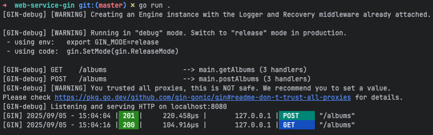
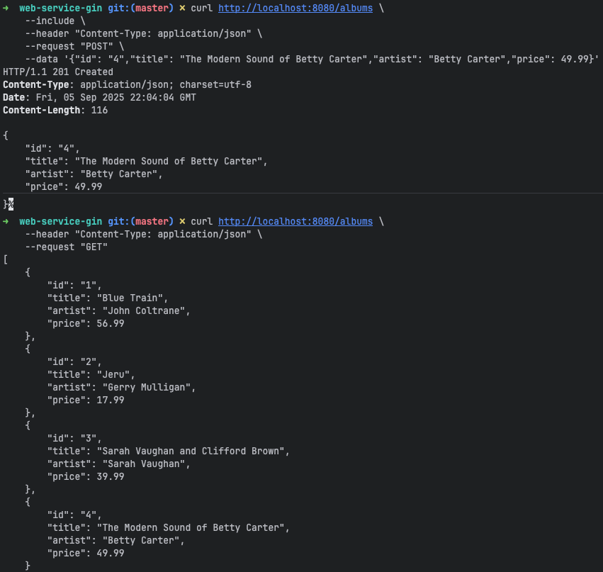
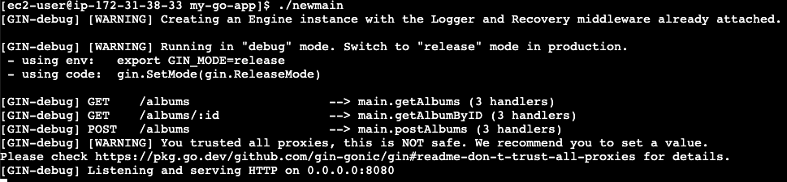
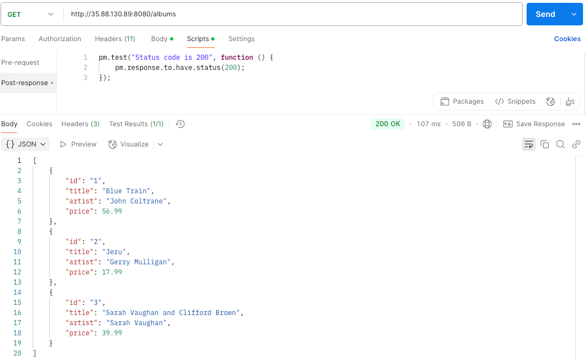
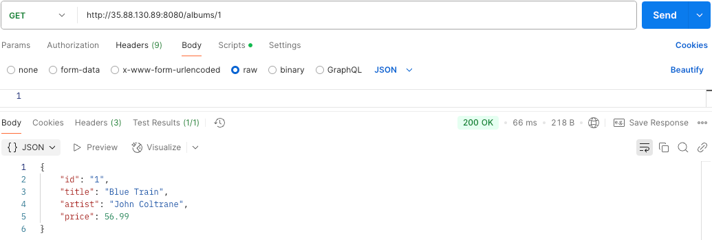
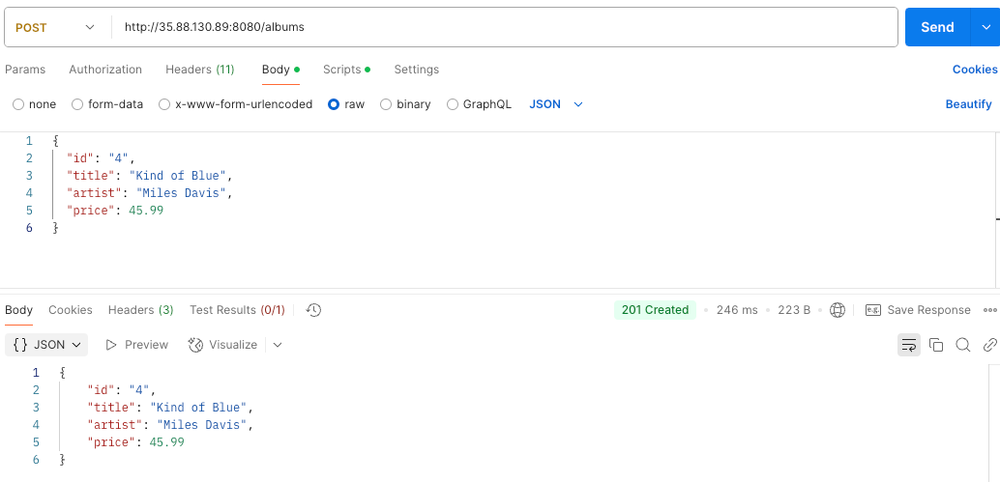

# HW1 - Go REST API with Cloud Deployment

A simple RESTful API built with Go and Gin framework, demonstrating local development, cloud deployment on Google Cloud Platform and AWS EC2, and performance testing.

## Overview

This project implements a simple album management REST API using Go and the Gin web framework. The API supports basic CRUD operations and has been deployed across multiple cloud platforms to demonstrate different deployment strategies and performance characteristics.

## Technologies Used

- **Go** - Backend programming language
- **Gin** - Web framework for Go
- **Google Cloud Platform** - Initial cloud deployment
- **AWS EC2** - Production-like cloud deployment
- **Python** - Performance testing scripts
- **matplotlib/numpy** - Data visualization for performance analysis

# Go Albums REST API

Simple RESTful API for managing a music album collection, built with Go and Gin framework. Demonstrates cloud deployment on GCP and AWS EC2 with performance testing.

## Quick Start

```bash
go mod init albums-api
go get github.com/gin-gonic/gin
go run main.go
```

Server runs on `http://localhost:8080` (local) or `http://0.0.0.0:8080` (cloud)

## API Endpoints

| Method | Endpoint | Description |
|--------|----------|-------------|
| GET | `/albums` | Get all albums |
| POST | `/albums` | Create new album |
| GET | `/albums/:id` | Get album by ID |

## Sample Data

API comes pre-loaded with jazz albums:
- Blue Train (John Coltrane) - $56.99
- Jeru (Gerry Mulligan) - $17.99
- Sarah Vaughan and Clifford Brown - $39.99


## Part I: Local Host & GCP Deployment

**Local Host Test**



**Screenshot Placeholder: GCP deployment running**

## Part II: AWS EC2 Deployment

### Cross-Compilation
```bash
GOOS=linux GOARCH=amd64 go build -o albums-server main.go
```

### EC2 Setup
- **Instance**: t2.micro (Amazon Linux 2023)
- **Security Groups**: SSH (port 22), HTTP (port 8080)
- **Upload**: `scp -i key.pem albums-server ec2-user@<IP>:/home/ec2-user/`

### Running on EC2
```bash
chmod +x albums-server
./albums-server
```

**EC2 instance running**

**curl testing on EC2**



## Part III: Performance Testing

Python load testing script analyzing response times over 30 seconds:

```python
import requests, time, matplotlib.pyplot as plt

# Test results show typical "long tail" latency distribution
# Most requests: <50ms, Some outliers: >200ms
```

**Key Metrics:**
- Total Requests: ~X requests
- Average Response Time: X.X ms
- 95th Percentile: X.X ms
- Max Response Time: X.X ms

**Screenshot Placeholder: Response time histogram**
**Screenshot Placeholder: Response times over time plot**

## Learning Outcomes

**Go Concepts:**
- `go mod init` - Initialize module and dependency management
- `go get .` - Download and install dependencies
- RESTful API structure with Gin framework

**Cloud Deployment:**
- **Localhost vs Cloud**: Local development vs remote server hosting
- **Security Groups**: Firewall rules for port access (SSH:22, HTTP:8080)
- **Cross-compilation**: Building binaries for different OS/architecture
- **SSH**: Secure shell access to remote servers

**Performance Insights:**
- Response time distribution shows "long tail" behavior
- Network latency vs processing time impact
- Single-instance limitations and scaling considerations

## Troubleshooting

**Permission Issues:**
```bash
sudo chmod -R 777 <filename>
```

**Architecture Mismatch:**
Try different GOARCH: `arm64` instead of `amd64`

**Security Group:**
Ensure port 8080 is open for inbound traffic

## Files Structure
```
├── main.go           # API server code
├── go.mod           # Module definition  
├── albums-server    # Compiled binary
└── load_test.py     # Performance testing
```