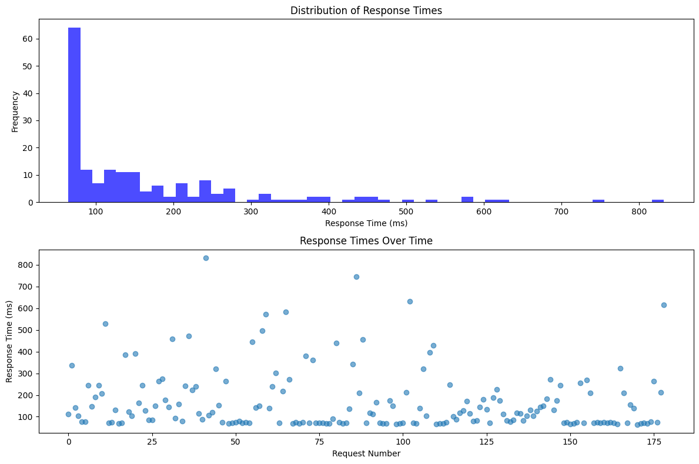

# HW1 - Go REST API with Cloud Deployment

A simple RESTful API built with Go and Gin framework, demonstrating local development, cloud deployment on Google Cloud Platform and AWS EC2, and performance testing.

## Overview

This project implements a simple album management REST API using Go and the Gin web framework. The API supports basic CRUD operations and has been deployed across multiple cloud platforms to demonstrate different deployment strategies and performance characteristics.

## Technologies Used

- **Go** - Backend programming language
- **Gin** - Web framework for Go
- **Google Cloud Platform** - Initial cloud deployment
- **AWS EC2** - Production-like cloud deployment
- **Python** - Performance testing scripts
- **matplotlib/numpy** - Data visualization for performance analysis

# Go Albums REST API

Simple RESTful API for managing a music album collection, built with Go and Gin framework. Demonstrates cloud deployment on GCP and AWS EC2 with performance testing.

## Quick Start

```bash
go mod init albums-api
go get github.com/gin-gonic/gin
go run main.go
```

Server runs on `http://localhost:8080` (local) or `http://0.0.0.0:8080` (cloud)

## API Endpoints

| Method | Endpoint | Description |
|--------|----------|-------------|
| GET | `/albums` | Get all albums |
| POST | `/albums` | Create new album |
| GET | `/albums/:id` | Get album by ID |

## Sample Data

API comes pre-loaded with jazz albums:
- Blue Train (John Coltrane) - $56.99
- Jeru (Gerry Mulligan) - $17.99
- Sarah Vaughan and Clifford Brown - $39.99


## Part I: Local Host & GCP Deployment

**Local Host Test**


**GCP deployment running**


## Part II: AWS EC2 Deployment

### Cross-Compilation
```bash
GOOS=linux GOARCH=amd64 go build -o albums-server main.go
```

### EC2 Setup
- **Instance**: t2.micro (Amazon Linux 2023)
- **Security Groups**: SSH (port 22), HTTP (port 8080)
- **Upload**: `scp -i key.pem albums-server ec2-user@<IP>:/home/ec2-user/`

### Running on EC2
```bash
chmod +x albums-server
./albums-server
```

**EC2 instance running**

**curl testing on EC2**


## Part III: Performance Testing

Python load testing script analyzing response times over 30 seconds:

```python
import requests, time, matplotlib.pyplot as plt

# Test results show typical "long tail" latency distribution
# Most requests: <50ms, Some outliers: >200ms
```

**Key Metrics:**
- Total Requests: ~180 requests
- Average Response Time: 165.4 ms
- 95th Percentile: 425.8 ms
- Max Response Time: 615.9 ms



1. Distribution Shape:
The histogram shows a clear long tail with most requests around 70-150ms but outliers reaching 600ms+. Approximately 10-15% of requests fall into the "slow" category (>300ms).
2. Consistency:
Response times are highly inconsistent with dramatic spikes - requests can jump from 70ms to 500ms+ then back to 70ms. There's no clear pattern, indicating unpredictable resource contention or throttling.
3. Percentiles:
The large gap between median (~120ms) and 95th percentile (~400-500ms) indicates very high variability. This 3-4x difference shows that while most users get decent performance, the worst 5% experience significantly degraded service.
4. Infrastructure Impact:
The t2.micro's burstable CPU credits get exhausted under sustained load, causing throttling and response time spikes. Single vCPU and shared hardware resources create unpredictable performance bottlenecks.
5. Scaling Implications:
With 100 concurrent users, the single-threaded server would queue requests leading to timeout failures and response times in seconds. The system would likely become unresponsive due to resource exhaustion.
6. Network vs. Processing:
Both factors contribute - baseline 70ms suggests network latency, while 500-600ms spikes indicate server-side delays from CPU throttling. Testing locally on the EC2 instance with curl would isolate network vs processing time.
