# Hw 2: IaC, Docker, and Distributed Systems

## Part I: Map Reduce Paper Review

https://dl.acm.org/doi/10.1145/1327452.1327492

One of the most interesting and clever parts of the MapReduce paper is the mechanism to handle "stragglers"—individual machines that take an unusually long time to finish their task.

The problem is that a MapReduce job isn't complete until every single task is finished. This means one slow machine (a straggler) can become a major bottleneck.

The solution described in the paper is called "Backup Tasks."

When a MapReduce job is close to completion, the master node doesn't just wait for the last few in-progress tasks to finish. Instead, it proactively schedules backup executions of those remaining tasks on other idle worker machines. The task is marked as complete as soon as either the original execution or the backup execution finishes.

This is a trade-off. It uses a small amount of extra computational resources but dramatically reduces the job's overall completion time.
---

## Part II: Get Started With Terraform

In this section, I used Terraform to automate the creation of an AWS EC2 instance.

### Files Submitted

*   `main.tf`: The main Terraform configuration file that defines the AWS infrastructure.
*   `terraform.tfvars`: The file containing the variable definitions for the Terraform configuration, such as my SSH key name and IP address.

### AWS CLI Configuration

This section shows the process of configuring the AWS CLI with credentials from the AWS Academy Learner Lab. The `SignatureDoesNotMatch` error indicates an issue with the entered credentials, which was followed by a second attempt to configure them correctly.

The general commands used for configuration are:

```bash
aws configure
# Enter AWS Access Key ID
# Enter AWS Secret Access Key
# Enter Default region name (e.g., us-west-2)
# Enter Default output format (e.g., json)

aws configure set aws_session_token <YOUR_SESSION_TOKEN>

aws sts get-caller-identity
```


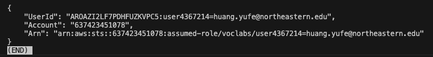

**1. Terraform Apply Output**

```bash
terraform init
terraform apply -auto-approve
```
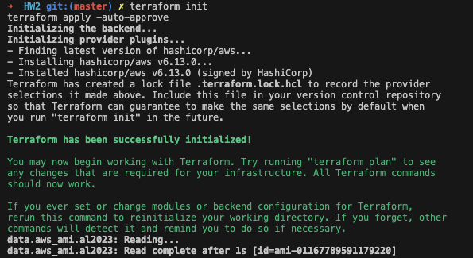

**2. AWS EC2 Console**

This screenshot shows the running EC2 instance in the AWS Management Console.

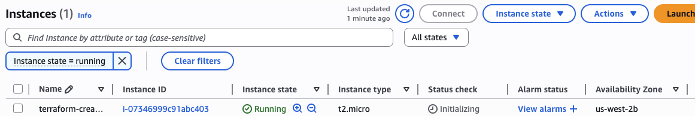

**3. Successful SSH Connection**

This screenshot shows a successful SSH connection to the EC2 instance from my local terminal.
```bash
# log into and control a remote computer over a network
ssh -i <PATH-TO-YOUR-PEM-KEY> ec2-user@<YOUR-EC2-PUBLIC-DNS>
#Exit the SSH Session
exit
```
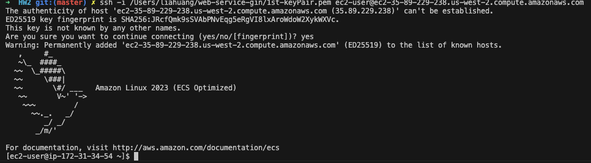

**4. Terraform Destroy Output**

This screenshot confirms that the resources were successfully destroyed after running `terraform destroy`.
```bash
terraform destroy -auto-approve
```
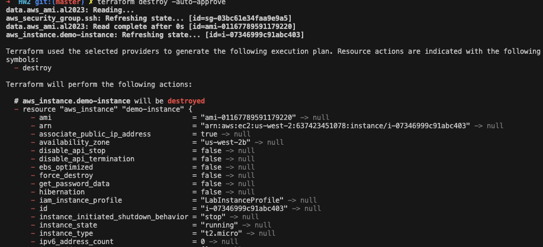
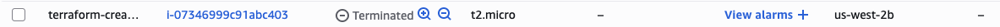
---

## Part III: Getting Started with Lightweight Containers and Docker

In this part, I containerized the Go application from Homework 1 using Docker and deployed it on the EC2 instance created with Terraform.

### Screenshots

**1. Docker Container Running Locally**

This screenshot shows the Go application running in a Docker container on my local machine.

1. Create the go.sum file:
```bash
go mod tidy
```
2. Build the Docker image with the correct command:
```bash
docker build -t gin-web-service .
```
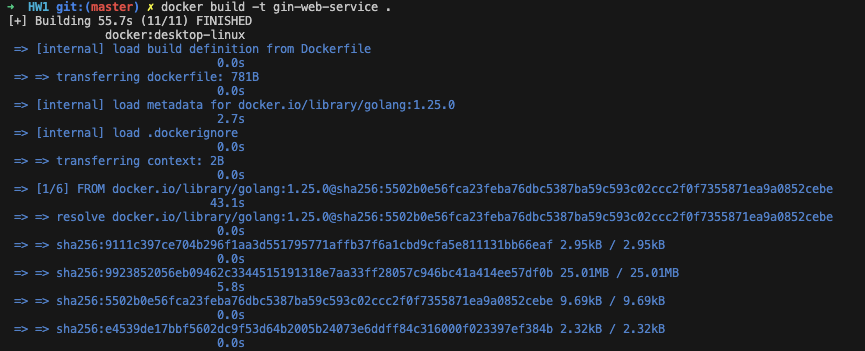

3. Run the container:
```bash
docker run -p 8080:8080 gin-web-service
```
3. Test:
```bash
curl http://localhost:8080/albums
```
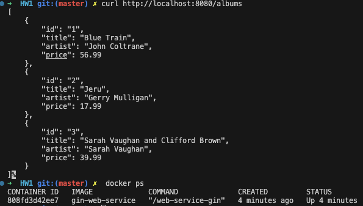

**2. Docker Container Running on EC2**

This screenshot shows the same Docker container running on the AWS EC2 instance.

In local
```bash
#Copy ALL your project files, not just the one executable. Exit your SSH session (exit) and from your local machine, run scp again to copy the necessary files.

# Copy the Dockerfile
scp -i <YOUR-KEY>.pem Dockerfile ec2-user@<YOUR-EC2-DNS>:~/my-app/

# Copy all the .go files
scp -i <YOUR-KEY>.pem *.go ec2-user@<YOUR-EC2-DNS>:~/my-app/

# Copy the go.mod and go.sum files
scp -i <YOUR-KEY>.pem go.mod go.sum ec2-user@<YOUR-EC2-DNS>:~/my-app/
```

In EC2
```bash
#Install Git in EC2
sudo yum install git -y
#Install Docker in EC2
sudo yum install docker -y
#start docker
sudo service docker start

#Create a project directory and move into it. Let's call it my-app.
mkdir go
cd go
#build
docker build -t gin-web-service .
```

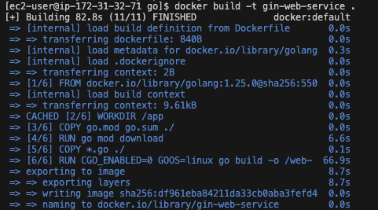
```bash
#Run the Docker Container
docker run -d -p 8080:8080 gin-web-service
#Verify the Container is Running
docker ps
```
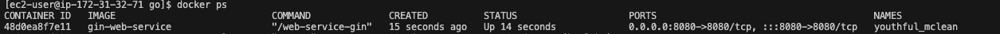


**3. GET Request to the EC2 Instance**

This screenshot shows the output of a successful GET request made to the public IP address of the EC2 instance, returning the album data.

###### GET /albums: It gets the list of all albums.
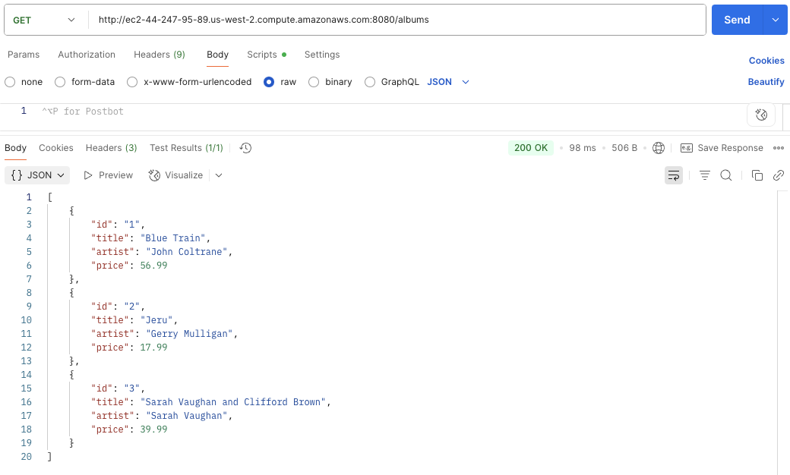

###### POST /albums: This adds a new album to the list.
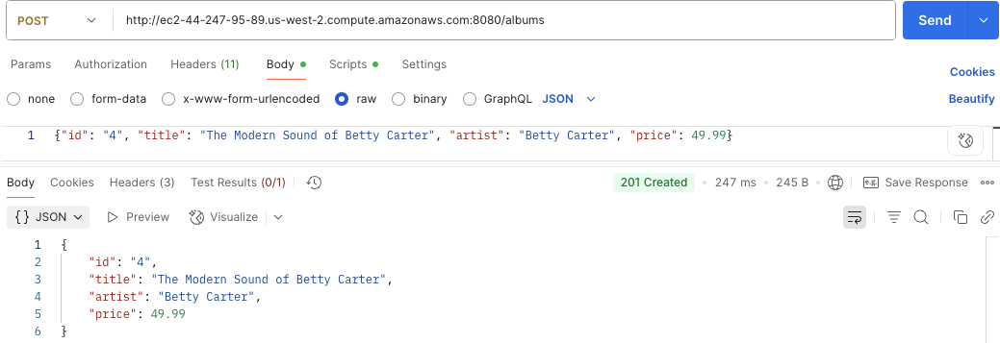
###### GET /albums/:id: This gets a single album by its specific ID.
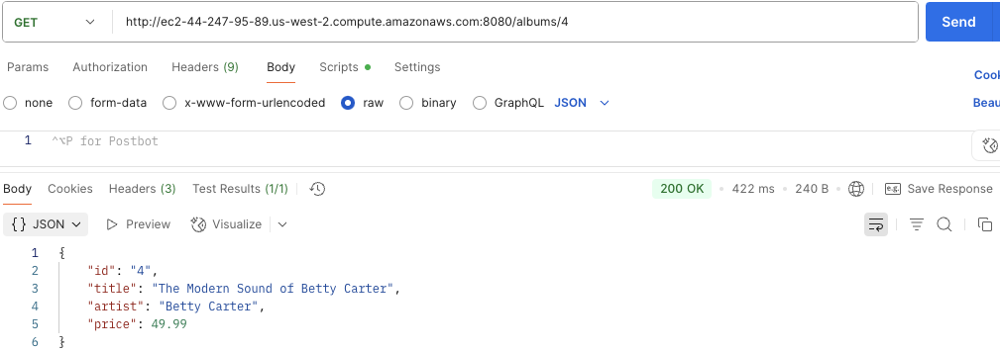

Of course. Here is a summary that addresses the key concepts and answers the questions posed in the assignment's "Result" section. You can use this for your README or as a basis for your discussion.

---

### Part III: Summary and Key Learnings

#### Why wasn't Go needed on the EC2 instance?

The EC2 instance did not need Go installed on it because the **Docker container is a self-contained, portable package**. The container bundles the compiled Go application along with all of its necessary dependencies, including the specific Go runtime environment it was built with.

The only software the host machine (the EC2 instance) needs is the Docker engine itself. The Docker engine is responsible for running the container, which then executes the Go application within its own isolated environment. This principle of packaging an application with its dependencies is the core reason Docker is so powerful for ensuring consistency across different machines.

#### Walkthrough of the Dockerfile

The `Dockerfile` is a set of instructions used to build our application image. Here is a step-by-step breakdown of what it does:

1.  **`FROM golang:1.25.0`**: This starts the build process from an official base image that already has Go version 1.25.0 installed. This is where the Go environment comes from.
2.  **`WORKDIR /app`**: This sets the working directory inside the container to `/app`, so all subsequent commands run from this location.
3.  **`COPY go.mod go.sum ./`**: This copies the Go module files into the container.
4.  **`RUN go mod download`**: This downloads all the application's dependencies (like the Gin framework). This step is done before copying the source code to take advantage of Docker's layer caching, which speeds up future builds if the dependencies haven't changed.
5.  **`COPY *.go ./`**: This copies our Go source code (e.g., `main.go`) into the container.
6.  **`RUN CGO_ENABLED=0 GOOS=linux go build -o /web-service-gin`**: This is the compilation step. It uses the Go toolchain (from the base image) to build the source code into a single, statically-linked executable file named `web-service-gin`.
7.  **`EXPOSE 8080`**: This serves as documentation, informing Docker that the application inside the container will listen on port 8080.
8.  **`CMD ["/web-service-gin"]`**: This specifies the default command to execute when the container starts, which is to run our compiled application.

### Further Exploration

#### Pros and Cons of Using Containers

*   **Pros**:
    *   **Portability**: A container can run on any machine that has Docker installed, regardless of the underlying OS.
    *   **Consistency**: It eliminates the "it works on my machine" problem by ensuring the development, testing, and production environments are identical.
    *   **Isolation**: Containers run in isolated environments, preventing conflicts between applications and their dependencies.
    *   **Efficiency**: Containers are much more lightweight than full virtual machines as they share the host OS kernel.

*   **Cons**:
    *   **Complexity**: Introduces a layer of abstraction that requires learning Docker commands, networking, and concepts.
    *   **Security**: Poorly configured containers or vulnerable base images can introduce security risks.

#### Difference between running the Go server in a container vs. directly on EC2

*   **Directly on EC2**: You would have to manually SSH into the machine and install the correct version of Go and any other system dependencies. The application would be tightly coupled to the environment of that specific EC2 instance, making it difficult to reproduce.
*   **Inside a Container**: The setup is defined in code (`Dockerfile`) and is completely reproducible. The host EC2 instance only needs Docker, keeping the host machine clean and simple.

#### AMIs vs. Docker Images for Reproducibility

The problem with our current setup is that if the EC2 instance is terminated, we would have to manually launch a new one and install Git and Docker all over again before we could run our container.

*   **AMI (Amazon Machine Image)**: An AMI is a snapshot of an entire virtual machine's disk, including the operating system and any installed software (like Git and Docker). You can create a custom AMI from your configured EC2 instance and then use it to launch new, identical instances that are pre-configured and ready to go. An AMI defines the **machine**.
*   **Docker Image**: A Docker image contains only the application and its dependencies, not the entire operating system. It is much smaller and more portable than an AMI. A Docker image defines the **application**.

**The key difference**: An AMI is used to create and configure the underlying host machine, while a Docker image runs *on top of* that machine to execute the application. A common best practice is to use a minimal AMI (like Amazon Linux) and then use tools like Terraform's `user_data` script to install Docker and run your containers.

## Part IV: Check this out!

This section includes the results and analysis of running the provided Python script to interact with two separate EC2 instances running the Go application.

### Script Output Screenshot

This screenshot shows the full terminal output after running the Python script.

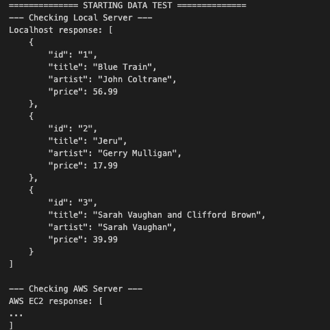

### Analysis of the Results

When the script first runs, it sends a GET request to both instances and retrieves the initial, identical list of albums from each.

The script then sends a POST request to add a new album, but **only to the second instance** (`EC2_URL2`).

When the script performs the GET requests for a second time, the output shows that the first instance (`EC2_URL1`) returns the original list of albums, while the second instance (`EC2_URL2`) returns the updated list, which now includes the new album ("The Modern Sound of Betty Carter").

This happens because the two EC2 instances are completely independent of each other. They are two separate servers running two separate instances of the Go application, each with its own in-memory data store. A change made to the data on one instance is not reflected on the other. This demonstrates a key challenge in distributed systems: maintaining data consistency across multiple, independent services.

