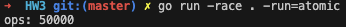
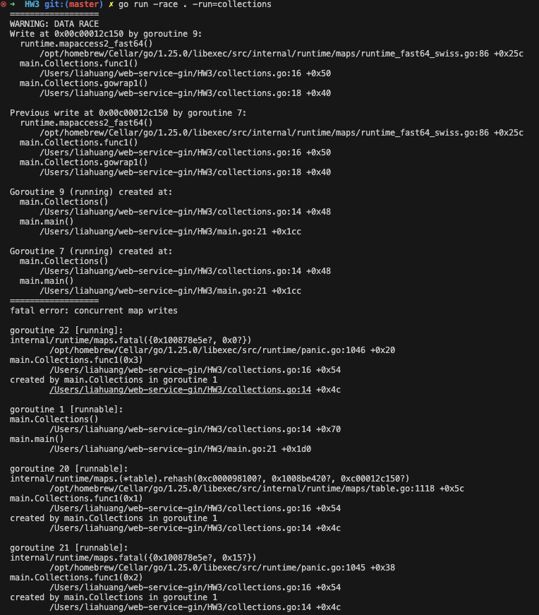
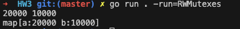
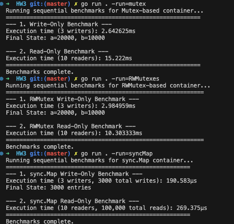
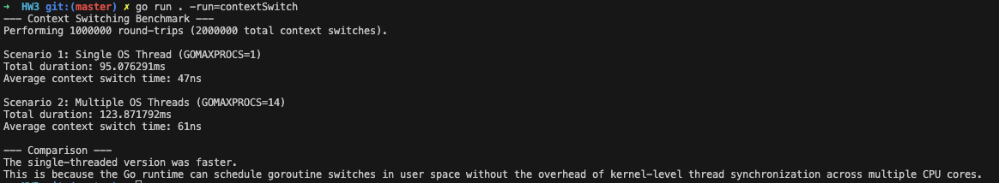

# PART1
http://dl.acm.org/doi/10.1145/359545.359563

### What to Like About the Paper

*   **Fundamental Concepts:** The paper introduces foundational concepts for reasoning about distributed systems. It defines the "happened before" relationship, which establishes a partial ordering of events without relying on physical clocks. This was a novel idea, inspired by special relativity, that successfully modeled time in a distributed environment.

*   **Logical Clocks (Lamport Clocks):** To implement the "happened before" relation, Lamport introduced a simple and elegant mechanism called logical clocks. Each process maintains a simple counter that is updated based on local events and messages received from other processes. This allows for the assignment of a timestamp to each event, creating a chronological sequence.

*   **Total Ordering of Events:** The paper demonstrates how to use these logical clocks to create a consistent total ordering of all events in the system. This is achieved by using the timestamps and, in the case of a tie, applying an arbitrary ordering of processes. This total ordering is crucial for solving synchronization problems.

*   **Practical Applications:** Lamport illustrated the utility of his algorithm with a solution to the distributed mutual exclusion problem, where multiple processes must share a single resource without conflict. The concepts have become fundamental in most distributed system implementations today.

*   **Physical Clock Synchronization:** The paper also extends the algorithm to synchronize physical clocks and provides a mathematical bound on how far out of sync they can become.

### What to Dislike or Question

*   **Inability to Capture Full Causality:** A major limitation is that Lamport clocks do not fully capture causality. While if event A caused event B, its timestamp will be lower, the reverse is not true; a lower timestamp for A does not guarantee it caused B. This makes it impossible to infer causal relationships from timestamps alone.

*   **Difficulty with Concurrent Events:** The algorithm struggles to deterministically order concurrent events (events that are not causally related). These events may receive the same timestamp, making their ordering arbitrary.

*   **Potential for Anomalous Behavior:** The paper itself notes that the total ordering can sometimes conflict with the real-world order of events as perceived by users, especially when external communication channels are involved.

*   **Scalability and Message Overhead:** The mutual exclusion algorithm presented requires a process to communicate with all other processes, which can lead to significant message overhead (3(N-1) messages per critical section execution) and may not scale well in large systems.

*   **No Fault Tolerance:** The proposed algorithm does not account for process failures. If a process crashes, the entire system could fail or become unstable.

---

# PART2

## Atomic Counters
```bash 
go run . -run=atomic
```


### 1. Using Atomic Integer Type (`atomic.Uint64`) not regular `uint64`

It solves the **data race** problem. When multiple goroutines (workers) try to read and write to the same normal variable at the same time, they can interfere with each other, leading to corrupted data and incorrect results.

A regular `uint64` is a public whiteboard. Anyone can walk up, see a number, go back to their desk to calculate a new number, and then come back to erase and write. It's chaos. A operation like `ops++` takes 3 steps:
1.  **Read** the current value of `ops`.
2.  **Add 1** to that value in a temporary register.
3.  **Write** the new value back to `ops`.

An `atomic.Uint64` is a whiteboard with a special locked cover. To change the number, you must press a button (`Add`). The cover locks, the number is instantly updated inside, and the cover unlocks. 
The entire process is instantaneous and uninterruptible.When you use `ops.Add(1)`, it Perform the entire `read-modify-write` sequence as a single, uninterruptible operation. Do not allow any other goroutine to interfere halfway through."
*   `ops.Add(1)`: Atomically adds a number to the value. This is the **safe way to write**.
*   `ops.Load()`: Atomically reads the value. This prevents "torn reads" (reading half of an old value and half of a new one) and ensures you are reading the most up-to-date value from memory, not a stale copy from a CPU cache. This is the **safe way to read**.
*   `ops.Store(value)`: Atomically writes a completely new value, overwriting the old one.

### 2. The WaitGroup (`sync.WaitGroup`)

**What Problem Does It Solve?**
It solves the **coordination** or **synchronization** problem. When your `main` function starts a bunch of goroutines, it doesn't automatically wait for them to finish. It will fire them off and then immediately continue to the next line of code. If there's nothing else to do, the `main` function will exit, and the entire program will shut down, **killing all the goroutines before they can finish their work.**

**The Three Key Methods:**
1.  **`wg.Add(n)`:** This increments the `WaitGroup` counter by `n`. You call this *before* you start a goroutine to tell the `WaitGroup`, "I'm about to start `n` tasks that you need to wait for."

2.  **`wg.Done()`:** This decrements the counter by one. You call this inside the goroutine (usually with `defer`) to signal, "The task I was doing is now complete."

3.  **`wg.Wait()`:** This blocks execution and makes the program wait at this line. It will not unblock and proceed until the `WaitGroup`'s internal counter becomes `0`.

### 3.Using `ops.Load()` not `fmt.Println(ops)`

1.  **Atomicity:** It prevents **"torn reads."**, The CPU instruction for an atomic load guarantees that the entire 64-bit value will be read in a single, uninterruptible operation.
2.  **Visibility:** It ensures you are reading the **most up-to-date value** from main memory.he atomic instruction acts as a "memory fence." It forces the CPU to synchronize its caches.

Let's break these down with an analogy.

### The Problem: A Digital Scoreboard

A 64-bit integer (`uint64`) `4,294,967,295`.

`00000000 00000000 00000000 00000001` `11111111 11111111 11111111 11111111`

After `ops.Add(1)`. The new value is `4,294,967,296`.

`00000000 00000000 00000000 00000001` `00000000 00000000 00000000 00000000`

Notice that a huge number of bits had to flip from `1` to `0`.

#### Danger 1: The "Torn Read" (Lack of Atomicity)

On some computer architectures (especially older 32-bit systems), the CPU cannot read a 64-bit number in a single, indivisible step. It has to do it in two pieces:
1.  Read the first 32 bits.
2.  Read the second 32 bits.

Now, imagine the worst possible timing:
1.  `main` goroutine starts to read the value of `ops`. It reads the **first 32 bits** of the old value (`000...000`).
2.  **INTERRUPTION!** The operating system pauses `main` goroutine and lets another goroutine run.
3.  The other goroutine executes `ops.Add(1)`, changing the entire 64-bit value in memory to the new value.
4.  **RESUME!** The operating system lets `main` goroutine continue. It now reads the **second 32 bits**, but it reads them from the *new* value (`000...001`).

Goroutine has read a Frankenstein value: the first half of the old number and the second half of the new number. You've read a completely corrupt, nonsensical value that never actually existed.

#### Danger 2: The Stale Read (Lack of Visibility)

Modern CPUs don't always read from main memory (RAM). To be faster, each CPU core has its own private, high-speed storage called a **cache**.

1.  A goroutine running on **CPU Core 1** executes `ops.Add(1)`. It might only update the value in its own private cache.
2.   `main` goroutine, running on **CPU Core 2**, decides to read `ops`. It looks in its own cache, which still has the old value. It might even read from main memory, which hasn't been updated yet by Core 1.

System have read a **stale value**. The value has been updated, but the change isn't visible to your goroutine yet.

### -race flag.
```bash 
go run -race . -run=atomic
```

##### There is no data race report. The race detector proves that concurrent code is free from this entire class of dangerous bugs.

## Collections
```bash 
go run -race . -run=collections
```


Program crashed due to a **data race**, which led to the fatal error: `concurrent map writes`.


### 1st Problem: Data Races and Unsafe Map Access

1.  **Maps Are Not Goroutine-Safe:** The standard Go `map` type is not safe for concurrent use. 

2.  **What is a Data Race?** 50 goroutines all try to write to the *exact same map* (`m`) simultaneously. They will inevitably trip over each other, put files in the wrong place, and corrupt the entire system.

3.  **Go's Built-in Protection:** When a goroutine writes to a map, it might need to perform complex operations, like resizing the map's underlying storage and re-organizing all the existing keys (a process called rehashing). If another goroutine tries to write to the map while it's in this delicate, intermediate state, the map's internal structure can become corrupted.

    Because this is such a common and dangerous bug, the Go runtime has a built-in detector for this specific scenario. Instead of allowing the map to become corrupted and causing strange bugs later in your program, Go chooses to stop everything immediately by causing a `panic`. The error message `fatal error: concurrent map writes` is Go telling you exactly what you did wrong.


### 2nd Problem

The line `fmt.Println(len(m))` runs immediately after the `for` loop starts the goroutines. It does **not** wait for them to finish. The main function would likely print a length of 0 (or some other small number) and exit before most of the 50,000 writes could even happen.

## Mutexes
```bash 
go run -race . -run=mutex
```


## RWMutexes
```bash 
go run -race . -run=RWmutex
```


### Changes
1.  **Struct Change**: The mu field in the Container was changed from sync.Mutex to sync.RWMutex.
2.  **The inc Method (The Writer)**: Still use c.mu.Lock() and c.mu.Unlock(). While this lock is held, no other goroutine can read from or write to the map.
3.  **The New get Method (The Reader)**: multiple goroutines can call get at the exact same time without blocking each other. They would only be blocked if a writer (a call to inc) was currently holding the write lock.

#### RWMutex vs. Mutex
**Use sync.Mutex:** When reads and writes are roughly balanced. A standard Mutex is simpler and has slightly less overhead.
**Use sync.RWMutex:** Data that read far more often than it is written. A good example is a configuration cache that is written once at startup but read by thousands of concurrent requests. Using an RWMutex in that case would provide a significant performance boost because all the read requests wouldn't have to wait for each other.

## Sync Map

### Quantitative Comparison of Results
```bash 
go run . -run=mutex 
go run . -run=RWMutexes
go run . -run=syncMap  
```


The critical difference to note is the **workload type**: `Mutex` and `RWMutex` were tested under high-contention, while `sync.Map` was tested under low-contention.

| Approach | Workload Type | Write-Only Time | Read-Only Time | Analysis Summary |
| :--- | :--- | :--- | :--- | :--- |
| **`sync.Map`** | **Low Contention** (Unique Keys) | **190 µs** (Fastest) | **269 µs** (Fastest) | Optimized for both low-contention writes and concurrent reads. |
| **`sync.Mutex`** | **High Contention** (2 Keys) | 2,642 µs (2.64 ms) | 15,222 µs (15.22 ms) | Writes are serialized. Reads are also serialized, causing a massive bottleneck. |
| **`sync.RWMutex`** | **High Contention** (2 Keys) | 2,984 µs (2.98 ms) | 10,303 µs (10.30 ms) | Writes are serialized. Reads are parallel, showing a significant but not perfect speedup. |

*Note: 1 millisecond (ms) = 1,000 microseconds (µs).*

---

### Explanation and Reasons Behind the Results

#### Analysis of the Write-Only Benchmarks

1.  **`sync.Map` (190 µs) - The Winner by a Landslide:**
    *   **Reason:** `sync.Map` used a **low-contention workload**. Each goroutine wrote to a unique set of keys (`goroutineID*numWritesPerGoroutine+i`). The goroutines were not fighting over the same resource. `sync.Map` is highly optimized for this "write-once, read-many" or "write-uniquely" pattern, minimizing lock contention internally and leading to its incredible speed.

2.  **`sync.Mutex` (2.64 ms) - The High-Contention Baseline:**
    *   **Reason:** This test was **high-contention**. All three goroutines fought to lock and update the same two keys. A `sync.Mutex` forces all operations into a single file line. Only one goroutine can hold the lock and perform a write at a time, so the work is done sequentially, not in parallel. This is the classic bottleneck scenario.

3.  **`sync.RWMutex` (2.98 ms) - Slightly Slower than Mutex:**
    *   **Reason:** In a write-only scenario, a `sync.RWMutex` must use its exclusive `Lock()` method, making it behave exactly like a regular `sync.Mutex`. It was slightly slower because a `RWMutex` has more complex internal logic to manage reader and writer states. You pay a small performance penalty for this machinery without getting any of its benefits (since there were no readers).

### Read Operations Dominate

**In a read-dominated workload, `sync.Map` is the fastest, followed closely by `sync.RWMutex`. A standard `sync.Mutex` is by far the worst choice.**

*   `sync.Map` excels because its read path is heavily optimized and often avoids locking entirely.
*   `sync.RWMutex` is the classic, general-purpose tool for this job, providing excellent read concurrency.
*   `sync.Mutex` will become a severe performance bottleneck as it serializes all read access.

### Trade-offs Between the Approaches

| Feature | `sync.Mutex` | `sync.RWMutex` | `sync.Map` |
| :--- | :--- | :--- | :--- |
| **Best Use Case** | Simple data protection, write-heavy or high-contention scenarios where reads are infrequent. | **Read-heavy workloads** where data is updated infrequently but read by many goroutines at once. | **Read-mostly caches**, especially with stable keys. Also good for low-contention writes. |
| **Performance** | Simple and efficient for exclusive access. A severe bottleneck for concurrent reads. | **Excellent for concurrent reads**. Writes are slower due to lock contention. | **Fastest for concurrent reads** and low-contention writes. Slower for high-contention writes. |
| **Type Safety** | **High.** The Go compiler enforces your `map[key]value` types. | **High.** Types are statically checked by the compiler. | **Low.** Uses `interface{}`, requiring you to do runtime type assertions which can fail. |
| **Ease of Use** | **Very Simple.** Just `Lock()` and `Unlock()`. | Simple. Requires choosing between `Lock()` (for writes) and `RLock()` (for reads). | Clean API (`Load`, `Store`). But has no `len()` method and requires type casting. |

## File Access
```bash 
go run . -run=fileAccess
```


buffered is around 60 times faster than unbuffered. The performance difference comes down to the number of **system calls** each function makes. A system call (or syscall) is a request made by a program to the computer's operating system. Operations that interact with hardware, like writing to a disk, are computationally expensive because they require switching from the user's program context to the operating system's kernel context and back.

*   **Unbuffered Write:** In this mode, every single call to `f.Write()` triggers a system call. To write 100,000 lines, it must perform 100,000 individual system calls. Each call has a significant overhead, and the cumulative effect of these calls is what makes the process slow.

*   **Buffered Write:** The `bufio.Writer` acts as a temporary storage area in your application's memory. When you call `writer.WriteString()`, the data is written to this in-memory buffer, which is a very fast operation. The data accumulates in the buffer until it's full (the default size is 4096 bytes) or until you explicitly call `writer.Flush()`. Only then is a single, large system call made to write the entire contents of the buffer to the disk. By grouping many small writes into one large operation, `bufio` drastically reduces the number of expensive system calls.

#### tradeoffs

| Feature | Buffered I/O | Unbuffered I/O |
| :--- | :--- | :--- |
| **Performance** | **High**. Significantly faster for frequent, small write operations because it minimizes system calls. | **Low**. Much slower for frequent, small writes due to the high overhead of a system call for each operation. |
| **Data Integrity** | **Lower Risk**. Data written to the buffer is not yet on the disk. If your program crashes before the buffer is flushed, that data is lost permanently. | **Higher Guarantee**. Each write is sent directly to the operating system, making it much more likely to be saved. This is critical for applications like logging where you want to see error messages immediately, even if the application crashes right after. |
| **Use Cases** | General-purpose file writing, writing large files, network I/O, and any situation where performance is a primary concern. | Error logging, writing critical data that must be persisted immediately, or situations where you have large, pre-assembled chunks of data to write at once. |

**key takeaway**

*   **Use buffered I/O by default.** For most applications, the performance gain is substantial and worth the small risk of data loss. It's crucial to remember to call `Flush()` before the file is closed or when you need to ensure data is written.
*   **Use unbuffered I/O selectively.** Choose unbuffered I/O only when you have a specific need for immediate data persistence and can accept the performance penalty.

## Context Switching
```bash 
go run . -run=fileAccess
```


*   **Single OS Thread is Faster:** The average context switch time in the single-threaded version is expected to be lower than in the multi-threaded version.

When `GOMAXPROCS` is set to 1, both goroutines are scheduled on the same OS thread. When one goroutine sends a value on the unbuffered channel, it blocks. The Go runtime scheduler then performs a context switch to the other goroutine, which is now ready to receive. This entire operation happens within the user space, managed by the Go runtime. It primarily involves saving the state of a few registers, such as the program counter and stack pointer, which is an extremely fast operation.

    Conversely, with multiple OS threads, the Go scheduler might place each goroutine on a different thread, potentially running on different CPU cores. While this allows for true parallelism for CPU-bound tasks, for this communication-heavy benchmark, it introduces overhead. The synchronization required for the channel communication might involve more complex and costly operations at the operating system level to coordinate between the different threads. This can include memory cache synchronization between cores and potentially putting an OS thread to sleep and waking it up, which are significantly slower than a user-space context switch.

### Broader Implications of Context Switching Costs

*   **Processes:** A context switch between processes is managed by the operating system kernel and is considerably more expensive. It involves saving the entire process context, which includes all CPU registers, memory maps, and other OS-specific data structures. This can take several microseconds.

*   **Containers:** Since containers are essentially isolated processes running on the same host kernel, a "context switch" between applications in different containers is equivalent to a process context switch on the underlying OS.

*   **Virtual Machines (VMs):** A context switch between VMs is the most heavyweight operation. It requires the hypervisor to save the entire state of the virtual machine's virtual CPU and memory. This is a much larger context than that of a single process and is, therefore, the most time-consuming.

In conclusion, the cost of a Go goroutine context switch is remarkably low because it is managed by the Go runtime in user space, avoiding the overhead of kernel-level scheduling. For highly communicative tasks, as demonstrated in this experiment, constraining goroutines to a single OS thread can be faster than allowing them to run on multiple threads due to the elimination of OS-level synchronization overhead. This illustrates a fundamental trade-off between the cost of communication and the benefits of parallelism.

# PART3
