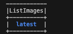
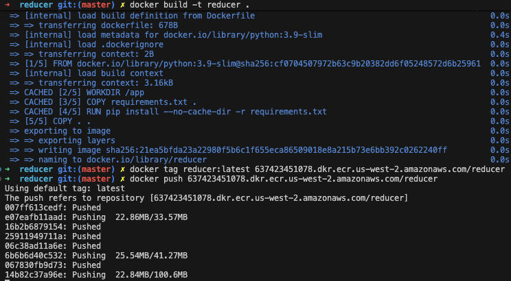
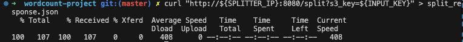
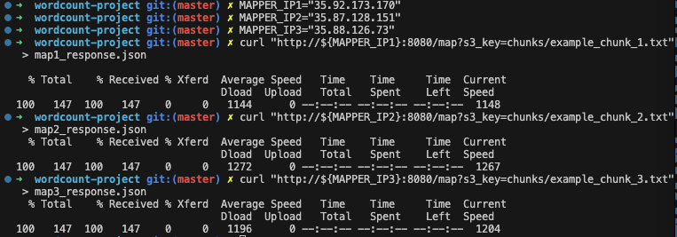
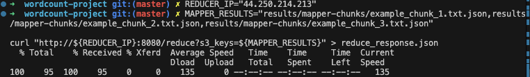
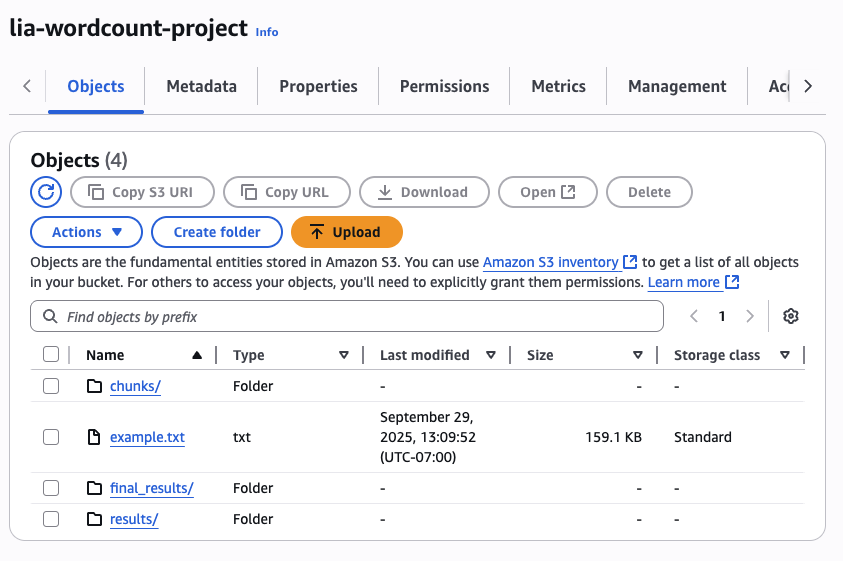

```bash
#Step 1: Configure 
aws configure
aws configure set aws_session_token <YOUR-TEMP-SESSION-TOKEBN>

#Step 2: Setup ECR- Repository name: hello-service
#Step 3: Push Docker Image to ECR
# Using AWS CLI
ECR_URL=$(aws ecr describe-repositories \
  --repository-names hello-service \
  --region us-west-2 \
  --query 'repositories[0].repositoryUri' \
  --output text)

echo "ECR URL: $ECR_URL"
# Extract base URL from full repository URL
ECR_BASE=$(echo $ECR_URL | cut -d'/' -f1)

# Login to ECR
# For Unix/Git bash
aws ecr get-login-password --region us-west-2 | docker login --username AWS --password-stdin $ECR_BASE


#Build and push the image
docker buildx build \
  --builder desktop-linux \
  --platform linux/amd64 \
  --push \
  -t $ECR_URL .

# List images in your repository
aws ecr list-images \
  --repository-name hello-service \
  --region us-west-2 \
  --query 'imageIds[*].imageTag' \
  --output table
```


```bash
#Step 4: Create ECS Cluster-Cluster name: default
#Step 5: Create Task Definition
```
### 1. Difference in Choosing EC2 vs. ECS

The choice between Amazon EC2 (Elastic Compute Cloud) and Amazon ECS (Elastic Container Service) comes down to your desired level of control versus ease of management.

*   **Amazon EC2 (Infrastructure as a Service - IaaS):** Think of EC2 as renting a virtual server in the cloud. You get a virtual machine (an "instance") and have full control over the operating system, runtime, and all software you install.
    *   **Choose EC2 when:**
        *   You need complete control over the environment.
        *   You are running legacy applications that are not containerized.
        *   You have specific security or compliance requirements that demand granular control over the OS.
        *   Your application has unique networking or storage needs that are easier to manage on a dedicated virtual machine.

*   **Amazon ECS (Container Orchestration as a Service):** ECS is a service specifically designed to run, manage, and scale Docker containers. You don't manage the underlying servers directly (especially when using the Fargate launch type); you simply provide a container image and define how it should run.
    *   **Choose ECS when:**
        *   Your application is built using microservices and is already containerized (or can be).
        *   You want to simplify deployment, scaling, and management of your applications.
        *   You want to abstract away the underlying infrastructure to focus solely on your application code.
        *   You are building a modern, cloud-native application.

**Analogy:** If EC2 is like leasing a plot of land where you must build the house from the foundation up, ECS (with Fargate) is like renting a fully furnished apartment where you just have to bring your personal belongings (your container).

---

### 2. What is a VPC and a Subnet?

*   **VPC (Virtual Private Cloud):** A VPC is your own logically isolated section of the AWS Cloud. It's a virtual network that you define and control, where you can launch AWS resources like EC2 instances or ECS tasks. You have complete control over this virtual networking environment, including selecting your own IP address range, creating subnets, and configuring route tables and network gateways.

*   **Subnet:** A subnet, or subnetwork, is a range of IP addresses within your VPC. You divide your VPC into one or more subnets to organize and secure your resources.
    *   **Public Subnet:** A subnet is considered "public" if its traffic is routed to an internet gateway, allowing resources within it to be directly accessible from the internet.
    *   **Private Subnet:** A subnet is "private" if it does not have a route to an internet gateway. Resources in a private subnet can't be reached directly from the internet, which is ideal for databases or backend services.

**How did you get access into the default VPC?**

Every AWS account comes with a pre-configured **default VPC** in each AWS Region. This is done to make it easier for new users to get started without having to manually set up and configure a network from scratch. When you launched your ECS task, you were able to select this default VPC because it was already created and available in your account, complete with default subnets, a route table, and an internet gateway.

---

### 3. What is TCP? How is it different than UDP?

*   **TCP (Transmission Control Protocol):** TCP is one of the main protocols of the Internet protocol suite. It is a **connection-oriented** protocol, meaning it establishes a reliable, three-way handshake between the sender and receiver before any data is sent. Its primary feature is **reliability**.
    *   **Key Features:**
        *   **Reliable:** Guarantees that data will be delivered in the correct order without errors. It retransmits lost packets.
        *   **Ordered:** Ensures that data packets are reassembled in the sequence they were sent.
        *   **Error-Checking:** Includes mechanisms to check for and correct errors in the data.
    *   **Use Cases:** Web browsing (HTTP/HTTPS), email (SMTP), and file transfers (FTP), where the integrity and order of data are critical.

*   **UDP (User Datagram Protocol):** UDP is a simpler, **connectionless** protocol. It sends packets of data (called datagrams) without establishing a formal connection first. Its primary feature is **speed**.
    *   **Key Features:**
        *   **Fast:** Because it doesn't have the overhead of establishing connections or ensuring delivery, it's much faster than TCP.
        *   **Unreliable:** It does not guarantee delivery, order, or error correction. Packets might be lost, duplicated, or arrive out of order.
    *   **Use Cases:** Live video and audio streaming, online gaming, and DNS lookups, where speed is more important than perfect reliability. Losing a few pixels in a video stream is better than having the whole stream pause to retransmit a lost packet.

| Feature | TCP (Transmission Control Protocol) | UDP (User Datagram Protocol) |
| :--- | :--- | :--- |
| **Connection** | Connection-oriented | Connectionless |
| **Reliability** | High (guarantees delivery) | Low (no guarantee of delivery) |
| **Speed** | Slower (due to overhead) | Faster (low overhead) |
| **Ordering** | Ordered (packets are sequenced) | Unordered |
| **Use Cases** | Web, Email, File Transfer | Streaming, Gaming, DNS |

---

### 4. How do you control resources allocated to a task?

In Amazon ECS, you control the resources (CPU and memory) allocated to a task directly within the **Task Definition**.

When you create or revise a Task Definition, you specify resource limits at two levels:

1.  **Task-Level:** You can set the total amount of CPU and memory that the entire task can use. This is a reservation for all the containers running within that task. For example, you can set the task to have `1 vCPU` and `2 GB` of memory.

2.  **Container-Level:** Within the task definition, you also define the containers that will run. For each container, you can specify its own CPU and memory limits.
    *   **Memory:** You can set a *soft limit* (a reservation) and a *hard limit* (an absolute cap). If a container exceeds its hard limit, it will be terminated.
    *   **CPU:** You can specify the number of "CPU units" to reserve for the container. 1024 CPU units represent one full vCPU.


# Project: Word Count using MapReduce on AWS ECS

### The Architecture: Splitter, Mappers, and a Reducer

1.  **The Client (You):** You will initiate the process by sending a request to the Splitter service with the location of the input text file in an S3 bucket.

2.  **Splitter Service (1 ECS Task):**
    *   **Input:** Receives a GET request containing the S3 URL of the main text file (e.g., `example.txt`).
    *   **Action:**
        1.  Downloads the file from S3.
        2.  Splits the content of the file into three equal (or roughly equal) parts or "chunks."
        3.  Uploads each of these three chunks as new text files to the S3 bucket.
    *   **Output:** Returns a JSON response containing the S3 URLs of the three newly created chunk files.

3.  **Mapper Services (3 ECS Tasks):**
    *   You will have three instances of the same Mapper service running.
    *   **Input:** Each Mapper receives a GET request with the S3 URL of one of the text chunks.
    *   **Action:**
        1.  Downloads its assigned text chunk from S3.
        2.  Processes the text to count the occurrences of each word. This is the "Map" phase.
        3.  Saves these word counts as a JSON file to S3. For example, `{"the": 15, "and": 12, ...}`.
    *   **Output:** Returns a JSON response with the S3 URL of its results file.

4.  **Reducer Service (1 ECS Task):**
    *   **Input:** Receives a GET request containing the S3 URLs of the three JSON files produced by the Mappers.
    *   **Action:**
        1.  Downloads all three JSON result files from S3.
        2.  Aggregates (sums up) the word counts from all three files to get the final total word count for the entire original text. This is the "Reduce" phase.
        3.  Saves this final aggregated result as a final JSON file in S3.
    *   **Output:** Returns the S3 URL of the final, aggregated results file.

### Step-by-Step Implementation 

#### Step 1: Set Up Your AWS Environment

1.  **Create an S3 Bucket:**
    *   Go to the S3 service in the AWS Console.
    *   Create a new bucket. Give it a unique name `lia-wordcount-project`.
    *   Upload the `example.txt` file you have into this bucket.

2.  **Create ECR Repositories:**
    *   Go to the Elastic Container Registry (ECR) service.
    *   Create three separate repositories, one for each service: `splitter`, `mapper`, and `reducer`.

3.  **Set Up ECS Cluster:**
    *   Go to the Elastic Container Service (ECS).
    *   Create a new cluster using the "AWS Fargate (serverless)" option. You can name it something like `wordcount-cluster`.

#### Step 2: Write the Application Code

You will need to write three small web applications. Python with the Flask framework and the `boto3` library (for AWS interaction) is an excellent choice for this.

**Project Structure:**

```
wordcount-project/
├── splitter/
│   ├── app.py
│   ├── Dockerfile
│   └── requirements.txt
├── mapper/
│   ├── app.py
│   ├── Dockerfile
│   └── requirements.txt
└── reducer/
    ├── app.py
    ├── Dockerfile
    └── requirements.txt
```

#### Step 3: Build, Tag, and Push Images to ECR

For each of your three services, you will run these commands from within their respective directories (`splitter/`, `mapper/`, `reducer/`).

```bash
Get your ECR repository URL:

# Using AWS CLI
ECR_URL=$(aws ecr describe-repositories \
  --repository-names hello-service \
  --region us-west-2 \
  --query 'repositories[0].repositoryUri' \
  --output text)

echo "ECR URL: $ECR_URL"
Authenticate Docker to ECR:

# Extract base URL from full repository URL
ECR_BASE=$(echo $ECR_URL | cut -d'/' -f1)

# Login to ECR
# For Unix/Git bash
aws ecr get-login-password --region us-west-2 | docker login --username AWS --password-stdin $ECR_BASE


# Build the Docker image
docker buildx build --platform linux/amd64 -t splitter .  # (or mapper, or reducer)

# Tag the image for ECR
docker tag splitter:latest your-aws-account-id.dkr.ecr.your-region.amazonaws.com/splitter:latest

# Push the image to ECR
docker push your-aws-account-id.dkr.ecr.your-region.amazonaws.com/splitter:latest
```

Repeat this process for the `mapper` and `reducer`.

#### Step 5: Create ECS Task Definitions and Run Tasks

For each service, you will create a Task Definition in the ECS console.

1.  **Navigate to Task Definitions** and click "Create new task definition."
2.  **Name:** `splitter-task`, `mapper-task`, `reducer-task`.
3.  **Launch type:** AWS Fargate.
4.  **CPU/Memory:** Start small (e.g., 0.25 vCPU, 0.5 GB).
5.  **Task role:** You need a role that has permissions to read and write to your S3 bucket. You may need to create a new IAM role with the `AmazonS3FullAccess` policy (for simplicity, though in production you'd use a more restrictive policy) and assign it here.
6.  **Add Container:**
    *   **Name:** `splitter-container` (or `mapper-container`, etc.)
    *   **Image URI:** Paste the ECR image URI you pushed in the previous step.
    *   **Port mappings:** Container port `8080`.

Once you have a task definition for each service, you can run them as tasks.

1.  Go to your `wordcount-cluster`.
2.  Click the "Tasks" tab and "Run new task."
3.  Select the Task Definition (e.g., `splitter-task`).
4.  For networking, select a VPC and at least one **public subnet**.
5.  **Crucially, set "Auto-assign public IP" to ENABLED.** This is how you will access your service.
6.  Create a new security group that allows inbound traffic on TCP port `8080` from `0.0.0.0/0` (Anywhere).

Run one task for the splitter, three tasks for the mapper, and one for the reducer.

#### Step 6: Execute the Workflow and Analyze Performance

1.  **Get Public IPs:** Find the public IP address for each running task.
2.  **Execute the process:** Use `curl` or a web browser to send requests to your services in the correct sequence.
```bash
# Assuming your input file is named 'example.txt'
SPLITTER_IP="44.244.30.179"
INPUT_KEY="example.txt"

# Send the request and save the JSON response to a file
curl "http://${SPLITTER_IP}:8080/split?s3_key=${INPUT_KEY}" > split_response.json

MAPPER_IP1="35.92.173.170"

# 1. Map Chunk 1
curl "http://${MAPPER_IP1}:8080/map?s3_key=chunks/example_chunk_1.txt" > map1_response.json

# 2. Map Chunk 2
curl "http://${MAPPER_IP2}:8080/map?s3_key=chunks/example_chunk_2.txt" > map2_response.json

# 3. Map Chunk 3
curl "http://${MAPPER_IP3}:8080/map?s3_key=chunks/example_chunk_3.txt" > map3_response.json

REDUCER_IP="44.250.214.213"
# Combine the three keys into a comma-separated string
MAPPER_RESULTS="results/mapper-chunks/example_chunk_1.txt.json,results/mapper-chunks/example_chunk_2.txt.json,results/mapper-chunks/example_chunk_3.txt.json"

curl "http://${REDUCER_IP}:8080/reduce?s3_keys=${MAPPER_RESULTS}" > reduce_response.json
```




3.  **Performance Analysis:** This is a key part of the interview showcase!
    *   **Baseline (Single-threaded):** First, run a simple local Python script that does the entire word count on the full `example.txt` file. Time how long this takes. This is your baseline.
    *   **Distributed Performance:** Time your distributed system. How long does the entire process take, from the first request to the splitter to getting the final URL from the reducer?
    *   **Plot the results:** Create a simple bar chart comparing the two:
        *   **X-axis:** "Execution Method" (with labels "Single-threaded Local" and "Distributed ECS")
        *   **Y-axis:** "Time (seconds)"
    *   **Experiment Further:** How does performance change if you split the file into 5 chunks instead of 3? Or 10? What happens if you use larger or smaller text files? Plotting these different scenarios can show a deep understanding of scaling and performance.

By completing this project, you will have a powerful, real-world example of microservices, containerization, and cloud architecture to discuss in your interview. Good luck