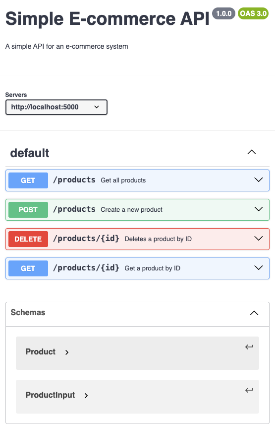

# Product API

This is a simple RESTful API for managing products in an e-commerce system.

## Getting Started

These instructions will get you a copy of the project up and running on your local machine for development and testing purposes.

### Prerequisites

- Python 3.9+
- Docker (optional, for containerized deployment)

### Running the Application

```bash
python app.py
```
### API Endpoints

```bash
#API Endpoints
#Get All Products
#URL: /products
#Method: GET
#Success Response:
#Code: 200 OK
http://localhost:5000/products
#Response Body:
[
    {
        "id": "a-unique-id",
        "name": "Laptop",
        "description": "A powerful laptop",
        "price": 1200.50
    }
]
#Create a New Product
#URL: /products
#Method: POST
#Request Body:

{
    "name": "Smartphone",
    "description": "A modern smartphone",
    "price": 800.00
}
#Success Response:
#Code: 201 Created

{
    "id": "another-unique-id",
    "name": "Smartphone",
    "description": "A modern smartphone",
    "price": 800.00
}
#Error Response:
#Code: 400 Bad Request

{
    "error": "Invalid input"
}
```
### Sample Data
```bash
"name": "Laptop", "description": "A powerful laptop", "price": 1200.50
```