```bash

aws configure
aws configure set aws_session_token <YOUR-TEMP-SESSION-TOKEBN>

cd terraform
terraform init
terraform apply -auto-approve

locust -f locustfile.py --host=
```
# PART1

#### Test 1 - Baseline: 5 users for 2 minutes
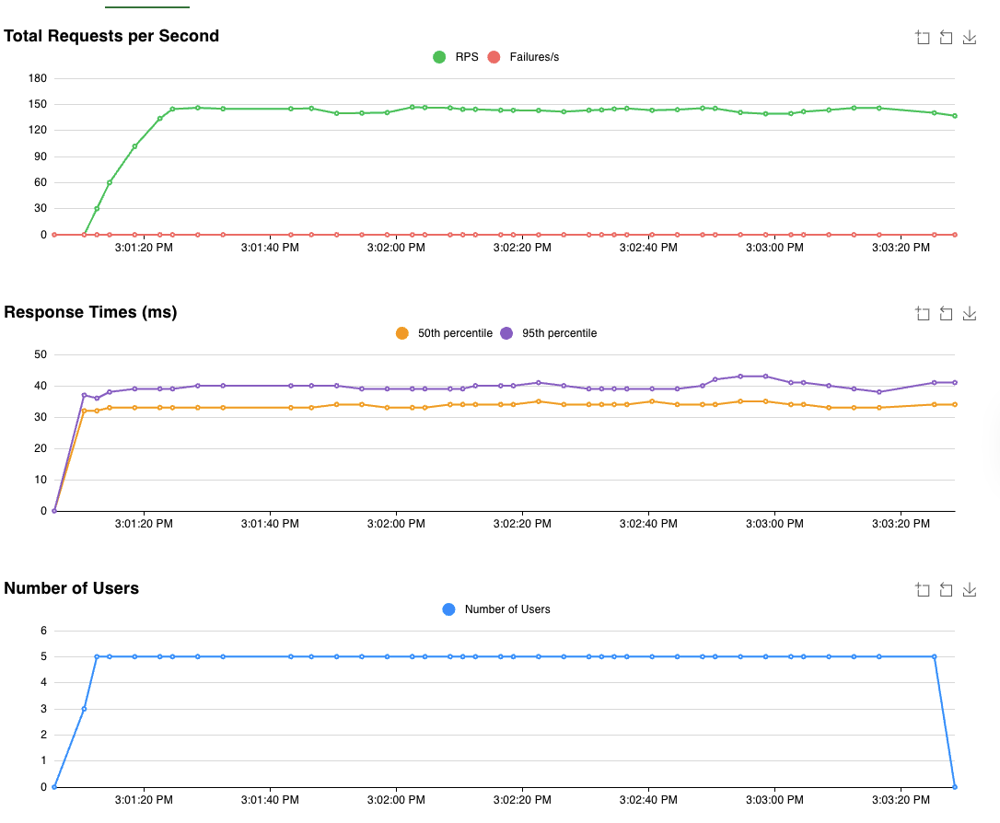
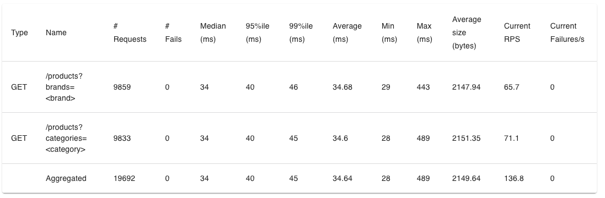

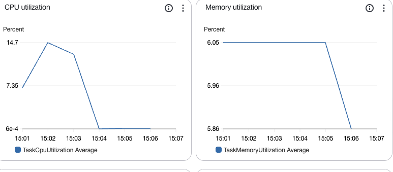

#### Test 2: 100 users for 4 minutes
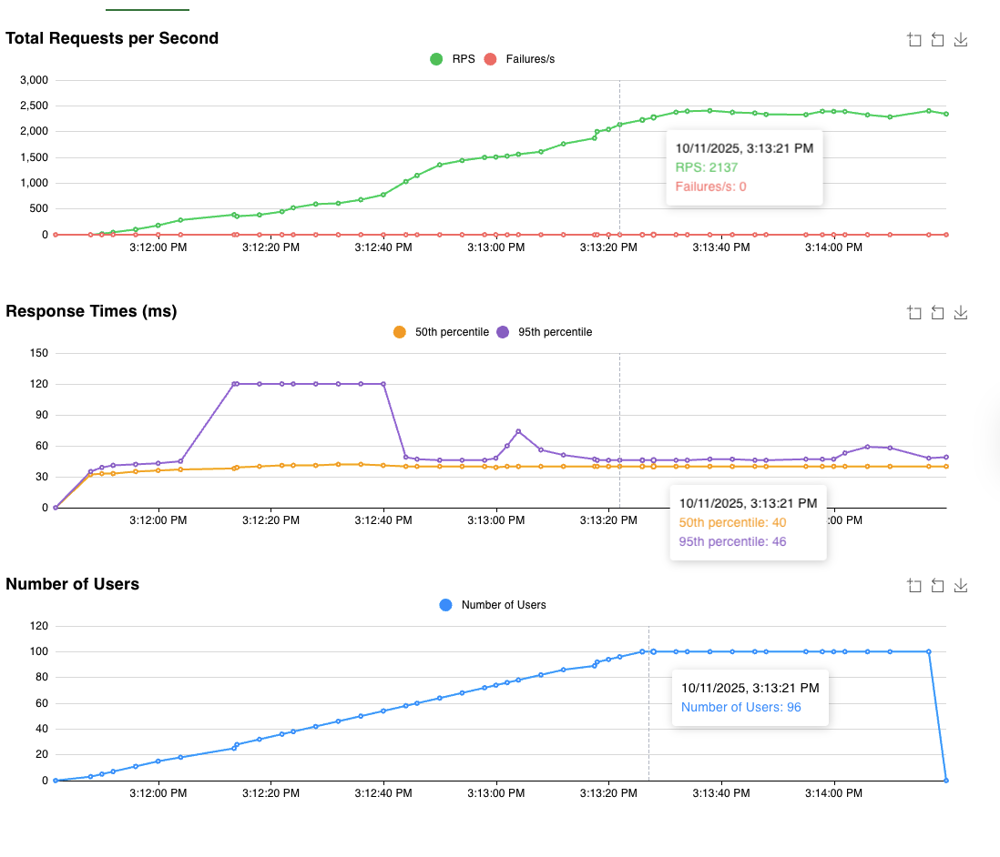
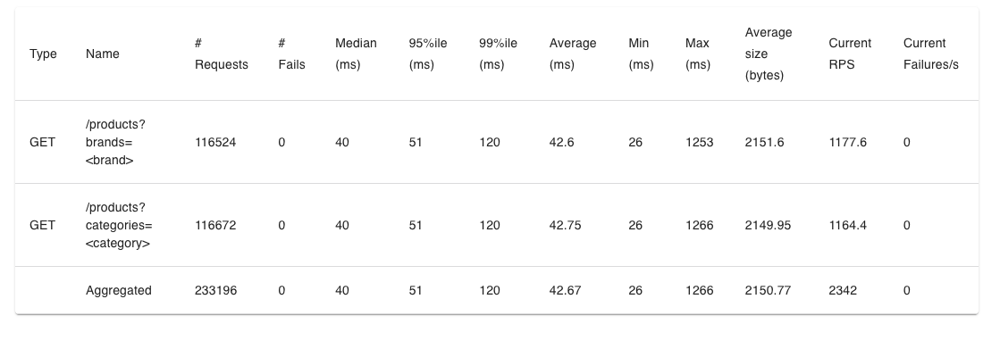
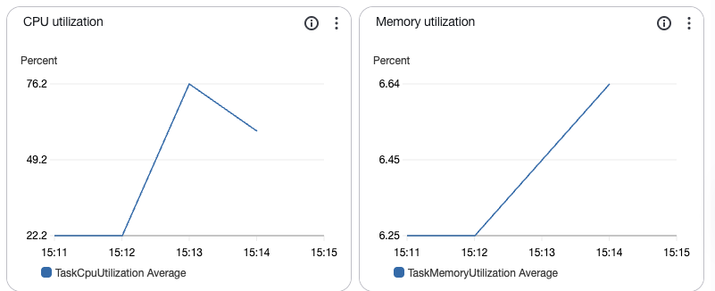

#### Test 3: Breaking Point: 200 users for 6 minutes
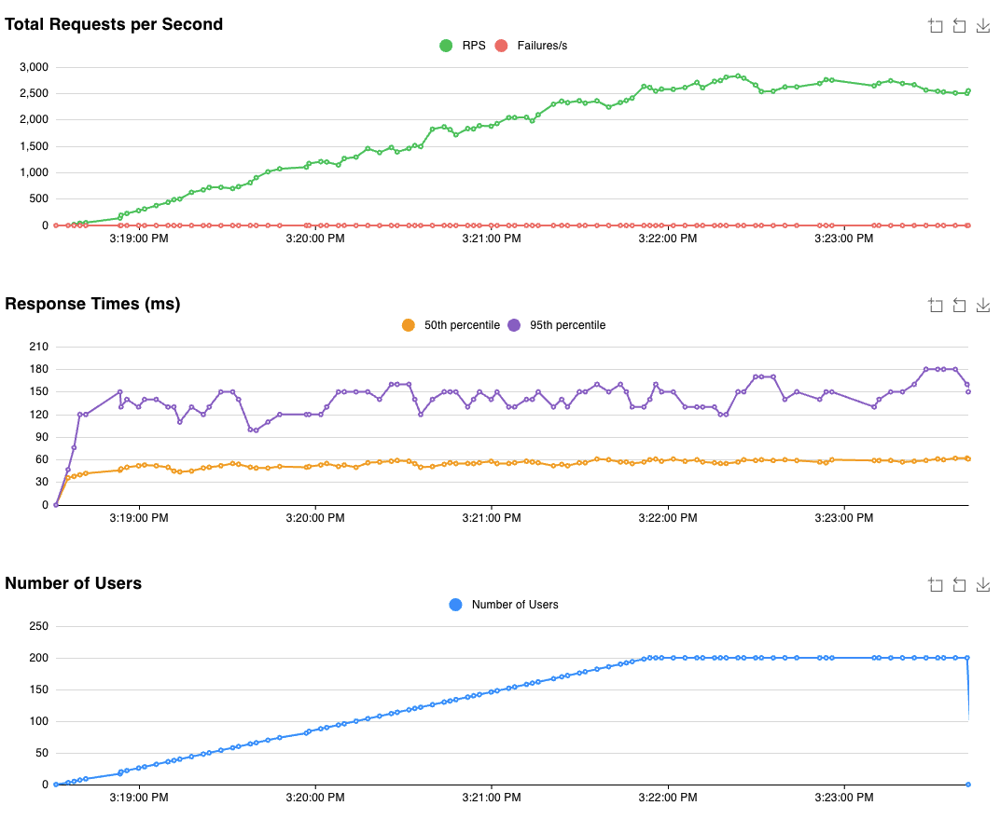
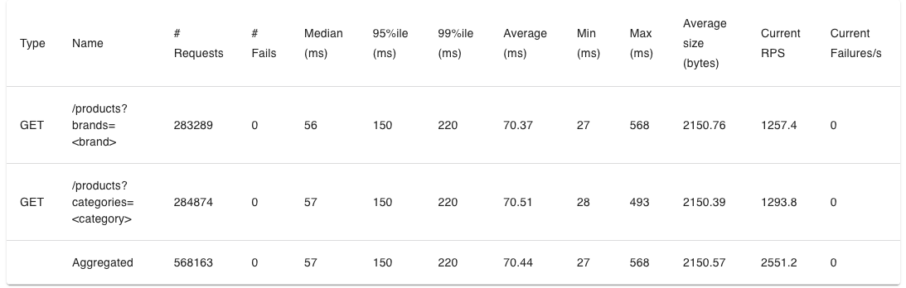

## Performance Analysis

### 1. What Happened When Load Increased?
**Response Time Degradation**:
Test 1 (5 users):    34.64 ms avg
Test 2 (100 users):  42.67 ms avg  (+23%)
Test 3 (200 users):  70.44 ms avg  (+103%)
**Key Observations**:
- Linear degradation in response times as users increased
- 95th percentile showed more dramatic impact (40ms → 150ms = 275% increase)
- System maintained stability with 0% failure rate across all tests
- Throughput scaled impressively: 150 → 2,609 RPS (17x increase)

**Resource Bottleneck**:
- **CPU became the limiting factor**, growing from 14.7% → 85.8%
- **Memory remained stable** at ~6-7%, indicating no memory leaks
- CPU growth was nearly linear with user count

---

### 2. Which Resource Hit the Limit First?

**Answer: CPU (Central Processing Unit)**

**Evidence from CloudWatch Metrics**:

| Metric | Test 1 | Test 2 | Test 3 | Trend |
|--------|--------|--------|--------|-------|
| CPU Utilization | 14.7% | 76.2% | 85.8% | ⬆️ **Approaching limit** |
| Memory Utilization | 6.05% | 6.64% | 7.23% | → Stable |

**Why CPU is the bottleneck**:
1. **Linear search algorithm**: Each request scans 100 products sequentially
2. **String operations**: Case-insensitive string matching (`strings.ToLower()`, `strings.Contains()`) on every product
3. **No caching**: Every request performs full computation
4. **CPU-bound workload**: The task is inherently computational, not I/O bound

**Memory Analysis**:
- Memory stayed nearly flat (6% → 7%), confirming:
  - Products are loaded once at startup (not per request)
  - No memory leaks in the application
  - Memory is not the constraint

---

### 3. How Much Did Response Times Degrade?

**Detailed Breakdown**:

| Metric | Test 1 → Test 2 | Test 1 → Test 3 |
|--------|-----------------|-----------------|
| **Average Response Time** | +23% (+8ms) | +103% (+35.8ms) |
| **95th Percentile** | +200% (+80ms) | +275% (+110ms) |
| **Max Response Time** | +159% (+777ms) | +16% (+79ms) |

**Performance Under Load**:
- Average response times remained acceptable even at 200 users (<100ms)
- 95th percentile degradation was more significant, indicating tail latency issues
- Max response time surprisingly improved in Test 3, possibly due to better connection pooling

### 4. Could You Solve This by Doubling CPU (256 → 512 units)?

**Answer: YES - This is a scaling problem, not an optimization problem.**

**Evidence Supporting Vertical Scaling**:

1. **CPU-Bound Workload**:
   - Current CPU at 85.8% under 200 users
   - Doubling CPU would theoretically support ~400 users at 85% utilization
   - Linear relationship between CPU and throughput observed

2. **Code is Already Efficient**:
   - Simple linear search through 100 products
   - Minimal string operations
   - No obvious optimization opportunities without changing algorithm
   - Adding indexes/caching would be "optimization" but changes architecture

3. **Memory is Not the Issue**:
   - Only 7.23% memory used at peak load
   - Plenty of headroom even with 512 MB → could handle much larger datasets

   **Key Insight**: CPU scales with load, memory does not → **CPU is the bottleneck**.

This document analyzes the performance of a system under increasing load, first in a baseline configuration and then with the addition of an Application Load Balancer (ALB) and auto-scaling.


# PART 2: Performance Analysis with ALB and Auto-Scaling

### Test 4: 200 users with ALB

With the addition of an Application Load Balancer (ALB) and two tasks, the system handled 200 users with an average response time of 43.36ms, CPU utilization at 67.9%, and memory at 7.03%. The load was distributed between the two tasks, with one showing 60.1% CPU and 6.8% memory, and the other 66.9% CPU and 6.84% memory. The target group maintained an average of 2 healthy hosts. Crucially, stopping one task resulted in the automatic regeneration of another, demonstrating resilience.

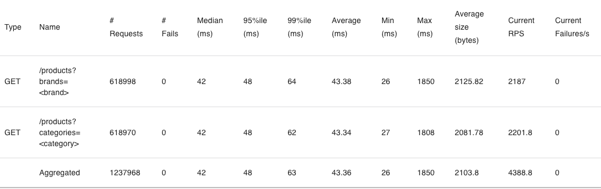
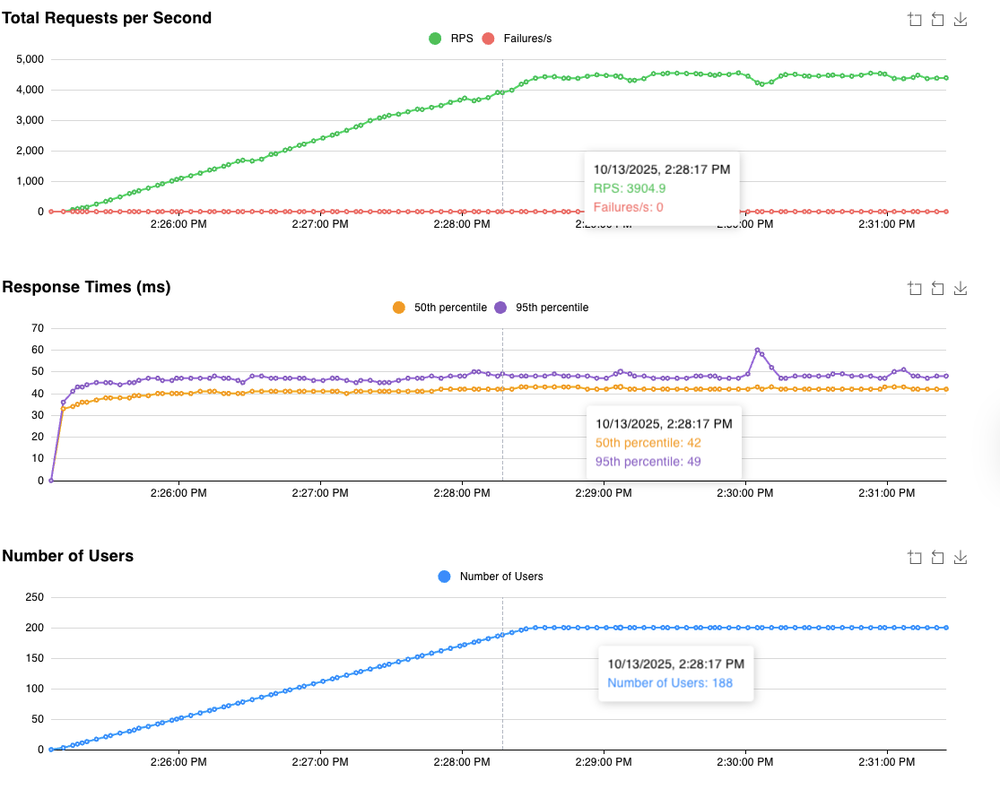

average 43.36ms
cpu 67.9%
memory 7.03%
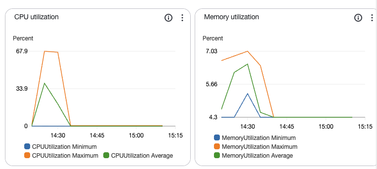

##### 2 tasks

1. cpu 60.1% memory 6.8%
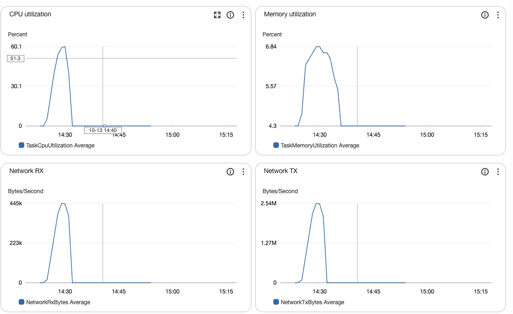
2. cpu 66.9%, memory 6.84%
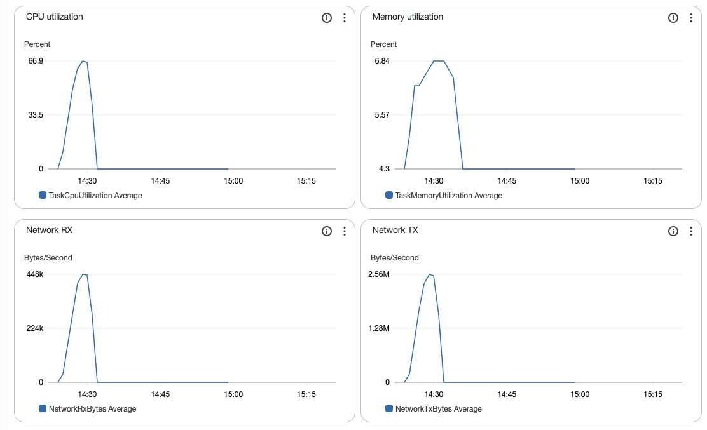

#### target groups healthy hosts
average 2 healthy hosts
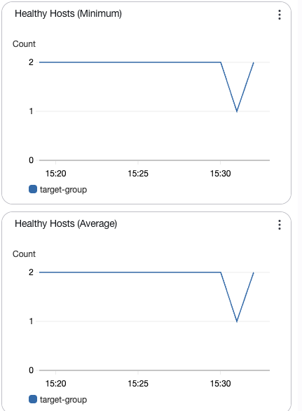
if stop 1 task, auto regenerate another task
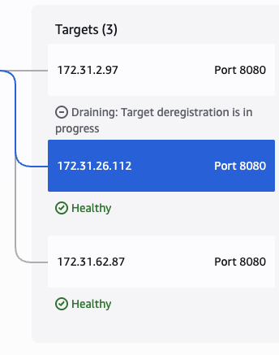

## Test 5: 600 users with ALB and Auto-Scaling

As the load increased to 600 users, the system's auto-scaling capabilities kicked in. The average response time initially rose but then dropped significantly from 120ms to 50ms as the number of tasks scaled from 2 to 3 at approximately 3:46 PM, and further to 4 tasks by the end of the test. At peak load, the average response time was 61.11ms, with CPU utilization reaching 98.5% and memory at 8%.

#### Response Time Dynamics during Scaling:

The response time dropped at 3:53 PM when the system reached 4 tasks. This indicates that horizontal scaling was effective in managing the increased load and maintaining acceptable performance.


- average 61.11ms
- cpu 98.5%
- memory 8%

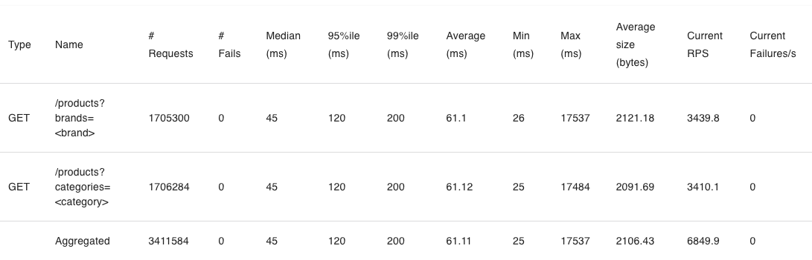
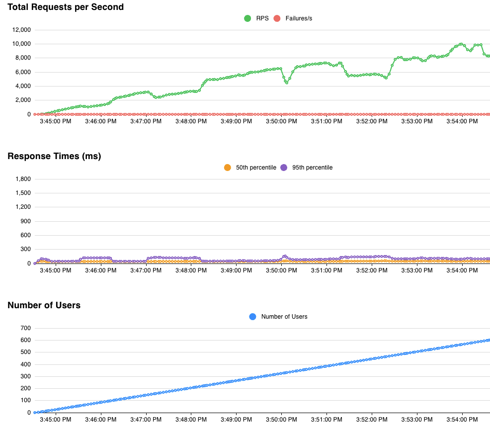
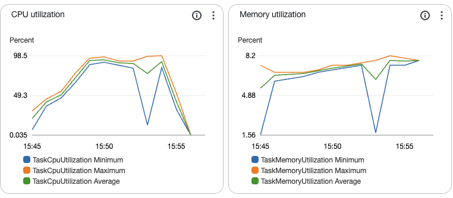

#### target groups healthy hosts

response time drop from 120 ms to 50ms when 2 tasks switch to 3 tasks at 3:46pm
finally reach tasks 4
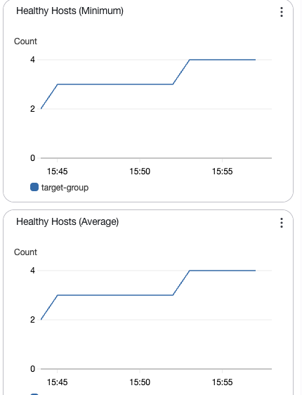

#### response time

drop at 15:53 when reach 4 tasks
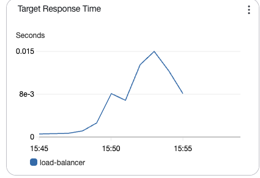

#### Task Performance during Scaling:

*   **Task 1 (1088af730f014c84a6729664b4c325f0):** Started around 3:44 PM with 97.6% CPU and 7.81% memory.

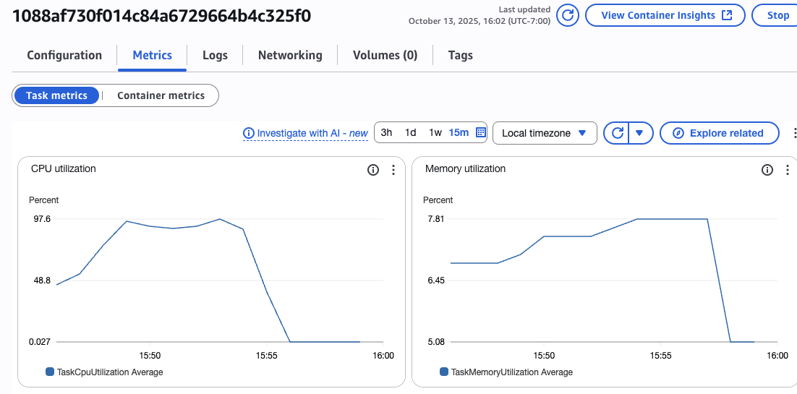
*   **Task 2 (2db855b01eb54604917441031a5d3d4f):** Started around 3:53 PM with 91.8% CPU and 7.42% memory.
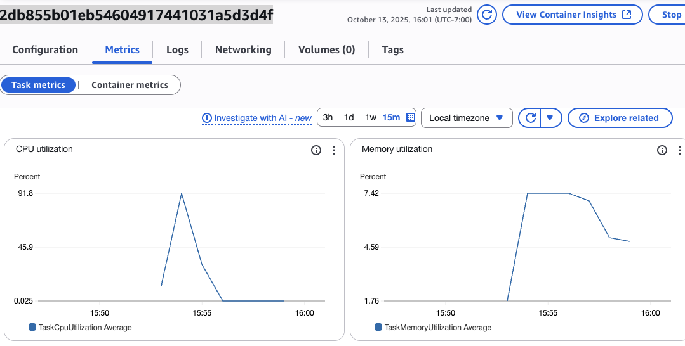

The final configuration with 4 tasks managed to handle the 600-user load, with individual task CPU utilization remaining high but the overall system performance (response time) improving due to the increased capacity.

### Resilience Testing:

When an instance (task) was stopped during a load test, the system demonstrated resilience. The load test continued successfully, and the target group automatically registered a new healthy host to replace the stopped one. This highlights a key advantage of horizontal scaling: individual instance failures do not bring down the entire service.

### CloudWatch Monitoring Observations:

*   **ECS Service CPU Utilization:** Increased significantly with load, prompting auto-scaling.
*   **ALB Request Count & Target Response Time:** Showed increased requests handled, and while response times initially climbed, they improved as auto-scaling added more targets.
*   **Auto Scaling:** The desired vs. running task count clearly showed the system scaling up to meet demand.
*   **Target Group Healthy Hosts:** Fluctuated as tasks were added and removed, but consistently maintained the required number of healthy instances.
