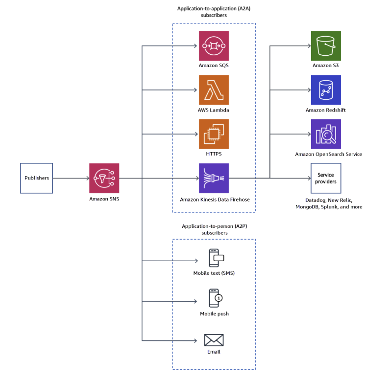
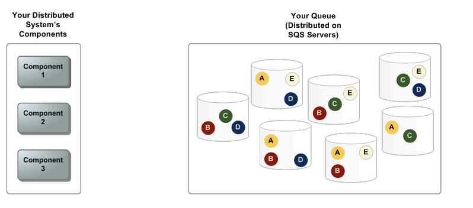
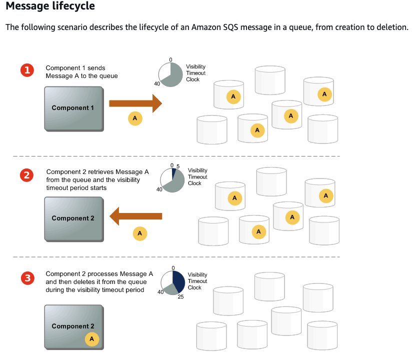
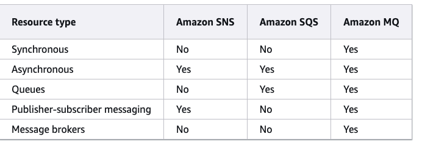

# AMAZON SNS

# AMAZON SQS
your system has several producers (components that send messages to the queue) and consumers (components that receive messages from the queue). The queue (which holds messages A through E) redundantly stores the messages across multiple Amazon SQS servers.

# AMAZON MQ
Amazon MQ fits best with enterprises looking to migrate from traditional message brokers, supporting standard messaging protocols like AMQP and MQTT, along with Apache ActiveMQ and RabbitMQ. 

## conclution
Both Amazon SQS and Amazon SNS are recommended for new applications that can benefit from nearly unlimited scalability and simple APIs. They generally offer more cost-effective solutions for high-volume applications with their pay-as-you-go pricing. 

We recommend Amazon MQ for migrating applications from existing message brokers that rely on compatibility with APIs.

# AWS Async Messaging

 To achieve the promises of microservices, such as being able to individually scale, operate, and evolve each service, this communication must happen in a loosely coupled and reliable manner.

* expose an API following the REST architectural

While REST APIs are common and useful in microservices design, REST APIs tend to be designed with synchronous communications, where a response is required. A request coming from an end-user client can trigger a complex communications path within your services landscape, which can effectively add coupling between the services at runtime.

* Asynchronous messaging

If loose-coupling is important, especially in a system that requires high resilience and has unpredictable scale, another option is asynchronous messaging.

- A queue is like a buffer. You can put messages into a queue, and you can retrieve messages from a queue. Message queues operate so that any given message is only consumed by one receiver, although multiple receivers can be connected to the queue.
- A topic is like a broadcasting station. You can publish messages to a topic, and anyone interested in these messages can subscribe to the topic. In this model, any message published to a topic is immediately received by all of the subscribers of the topic (unless you have applied the message filter pattern).

##### SQS
- an SQS queue can act as a load balancer in itself. The consumers, or target services, don’t need an HTTP server, but simply ask a queue for available messages. If you use AWS Lambda for your consumers, this process is even simpler, as the Lambda functions are automatically invoked when messages appear in an SQS queue. 
##### SNS
- Lambda function executions can be directly triggered by SNS messages. Without AWS Lambda, you need load balancers and web servers in your backend implementations to receive SNS notifications, as those are injected via web hooks into your services. SNS also provides the fan-out functionality that you would otherwise have to build using an intermediary component to implement a recipient list of subscribers.