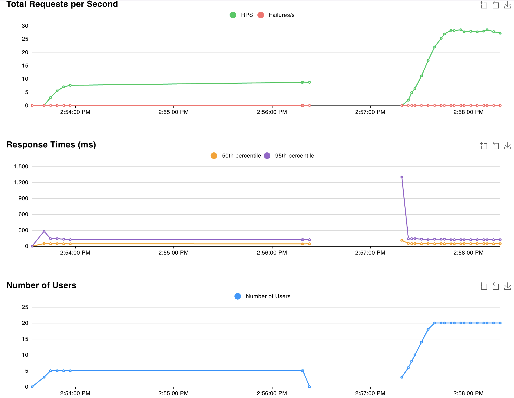
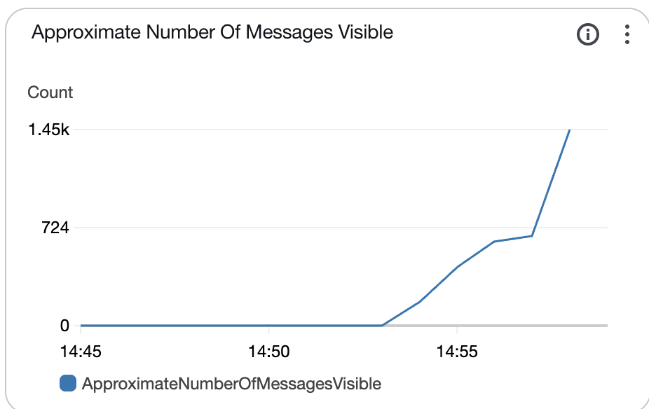
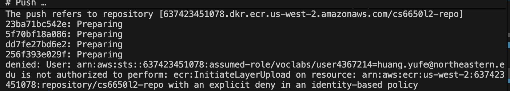
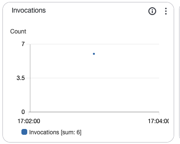
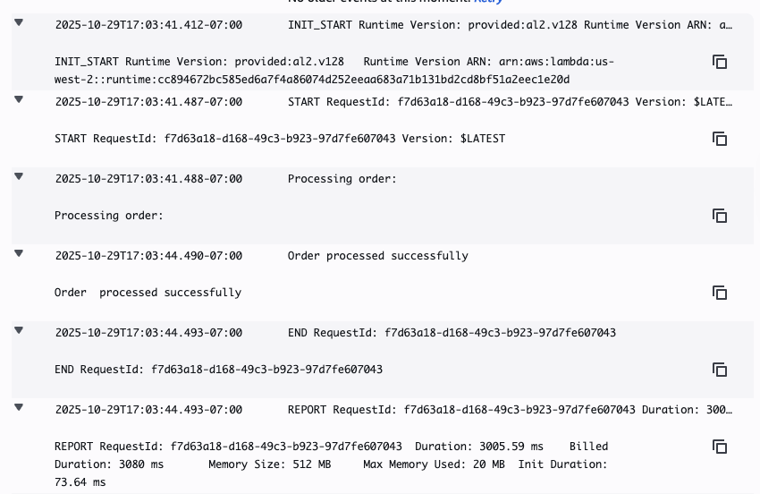
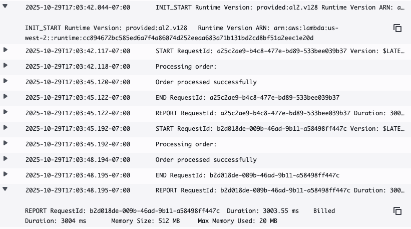
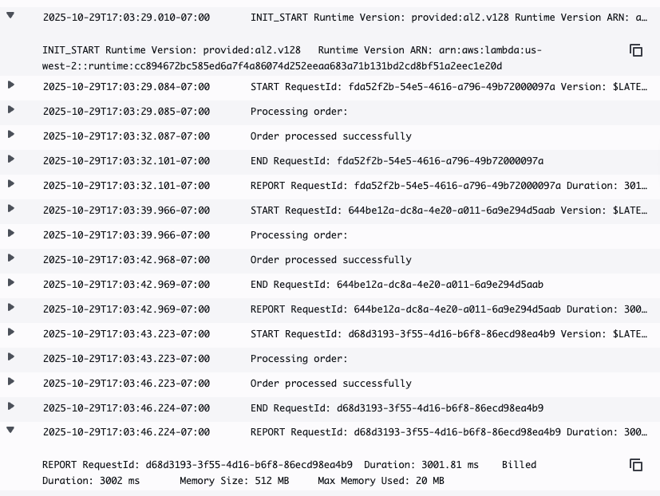

# PART II: The (Simulated!) Problem
Your e-commerce platform runs smoothly with synchronous order processing, handling 5 orders per second during normal operations. Each order requires payment verification that takes 3 seconds (simulate this delay in your system!). Careful here (and thank you Ryan for pointing this out!), when a Go routine sleeps, the thread is actually not blocked. If we want to simulate this bottleneck, we have to get a little more creative to limit throughput, like this buffered channel.

Then marketing launches a surprise flash sale. Expected load: 60 orders per second for one hour.

Your payment processor can't go faster. So what breaks first - your system or your reputation?
# Phase 1: Build Your Current System

Implement synchronous order processing:

```bash
POST /orders/sync → Verify Payment (3s delay) → Return 200 OK
```
#### Test Configuration (use Locust):

Spawn rate: 1 user/second (normal), 10 users/second (flash)
User wait time: random 100-500ms between requests
-  Test endpoint: POST /orders/sync
1. Test Normal Operations: 5 concurrent users, 30 seconds
Expected: 100% success rate


2. Test Flash Sale: 20 concurrent users, 60 seconds


# Phase 2: Analyze the Bottleneck
Do the math:

- Payment processor speed: 1 order per 3 seconds = 1/3 orders per second per processor
- With 20 concurrent customers: Maximum throughput = 20 × (1/3) = 20/3 ≈ 6.67 orders/second
- Flash sale demand: 20 orders/second
- System capacity: 6.67 orders/second
- Orders lost: 20 - 6.67 = 13.33 orders/second

- To handle the full 20 orders/second demand, you'd need at least 60 concurrent processors (20 orders/sec ÷ 1/3 orders/sec/processor = 60 processors).


1. Each user doesn't fire continuously - they wait 100-500ms after getting a response. So actual load is:

Request time: 3 seconds (processing)
Wait time: 0.3 seconds (average)
Total cycle: 3.3 seconds per user

Actual request rate:

5 users: 5/3.3 ≈ 1.5 req/s ✅ (well under 6.67 capacity)
20 users: 20/3.3 ≈ 6.06 req/s ✅ (just under 6.67 capacity!)

2. Locust's Behavior
Locust users don't start a new request until:

Previous request completes (or times out)
Wait time elapses

So if processing takes 3 seconds, users are naturally throttled!

# Phase 3: The Async Solution
```bash
Sync:   Customer → API → Payment (3s) → Response
Async:  Customer → API → Queue → Response (<100ms)
                           ↓
                   Background Workers → Payment (3s)
```

Implement with AWS services:

- SNS Topic: order-processing-events
- SQS Queue: order-processing-queue
- Visibility timeout: 30 seconds (default)
- Message retention: 4 days (default)
- Receive wait time: 20 seconds (long polling)
- Order Receiver: ECS service (1 task, handles both /sync and /async)
- Order Processor: ECS service (1 task, starts with 1 worker goroutine)

New Endpoint:
```bash
POST /orders/async → Publish to SNS → Return 202 Accepted


Project Architecture:
┌─────────────────────────────────────────────────────────────────┐
│                          INTERNET                                │
└────────────────────────┬────────────────────────────────────────┘
                         │
                         ▼
              ┌──────────────────────┐
              │   Application Load   │
              │      Balancer        │
              └──────────┬───────────┘
                         │
            ┌────────────┴────────────┐
            │                         │
            ▼                         ▼
    ┌──────────────┐         ┌──────────────┐
    │ /orders/sync │         │/orders/async │
    │              │         │              │
    │   Returns    │         │  Returns     │
    │   in ~3s     │         │  in <100ms   │
    └──────────────┘         └──────┬───────┘
                                    │
                                    │ Publishes
                                    ▼
                         ┌────────────────────┐
                         │    SNS Topic       │
                         │ order-processing-  │
                         │     events         │
                         └─────────┬──────────┘
                                   │
                                   │ Forwards
                                   ▼
                         ┌────────────────────┐
                         │    SQS Queue       │
                         │ order-processing-  │
                         │     queue          │
                         └─────────┬──────────┘
                                   │
                                   │ Polls (Long polling: 20s)
                                   ▼
                         ┌────────────────────┐
                         │ Order Processor    │
                         │   (Worker)         │
                         │                    │
                         │ Processes payment  │
                         │    (~3 seconds)    │
                         └────────────────────┘
```

Order Processor Pattern: Your processor continuously polls SQS:

ReceiveMessage (waits up to 20s for messages, returns up to 10)
For each message, spawn goroutine for processing
Repeat forever
Test the same flash sale load. Celebrate the 100% acceptance rate!
1. 5 users --- 20 users




# Phase 4: The Queue Problem

Check CloudWatch → SQS Metrics → ApproximateNumberOfMessagesVisible during your test.

That number climbing rapidly? That's your new problem.

- Analysis:

Order acceptance rate: ~60/second
Single worker processing rate: 1 order per 3 seconds = 0.33/second
Queue growth rate: 59.67 messages/second
Time to clear backlog: Never (queue grows indefinitely)
Customer service is getting calls: "Where's my order confirmation?"

- What this means:

Every second, your queue grows by ~60 messages
In 1 minute: 3,600 messages added to backlog
In 1 hour: 216,000 messages added to backlog

The Problem:
You have a massive throughput gap. A single worker can only handle 0.33 messages/second but you're receiving 60/second. That's a 180x difference!

- Solution - Scale Up Workers:

Minimum workers needed: 60 ÷ 0.33 = ~182 workers (just to break even)
Recommended workers: 200-250 workers (to handle bursts and clear backlog)

With proper scaling:

200 workers × 0.33/sec = 66 messages/second processed
This would actually clear the queue at 6 messages/second
Existing backlog would start decreasing

# Phase 5: Scale Your Workers

Configuration: Your Order Processor task has:

CPU: 256 units, Memory: 512MB (same task, just adjusting goroutines)
Start with 1 worker goroutine (from Phase 3)
Now scale the concurrent goroutines within this single task:

##### My current code doesn't have a way to control goroutine count.

It only has:
```go
paymentSemaphore = make(chan int, 5)  // Fixed at 5
```
5 goroutines: Processing rate = _ orders/second
20 goroutines: Processing rate = _
100 goroutines: Processing rate = _
For each test, document:

Configuration: Your Order Processor task has:
CPU: 256 units, Memory: 512MB

Current architecture: paymentSemaphore limits to 5 concurrent payments per task

* Test by scaling ECS tasks:

1 task (5 concurrent): Processing rate = ~1.67 orders/second
  - Peak queue depth: Grows rapidly (~58/sec growth)
  - Time to zero: Never (accumulating)
  - CPU: ~20-30%, Memory: ~100-150MB
  - Status: Insufficient

5 tasks (25 concurrent): Processing rate = ~8.33 orders/second
  - Peak queue depth: Still grows (~51/sec growth)
  - Time to zero: Never (accumulating)
  - CPU: ~60-80%, Memory: ~200-300MB
  - Status: Better but insufficient

20 tasks (100 concurrent): Processing rate = ~33 orders/second
  - Peak queue depth: Grows slower (~27/sec growth)
  - Time to zero: Never (accumulating)
  - CPU: ~95-100%, Memory: ~400-512MB
  - Status: Still can't keep up

## CloudWatch Monitoring

Navigate to CloudWatch → Metrics → SQS and monitor ApproximateNumberOfMessagesVisible during tests. Capture screenshots showing:

Queue depth spike during flash sale
Gradual drain as workers process backlog

## Analysis Questions

How many times more orders did your asynchronous approach accept compared to your synchronous approach?
What causes queue buildup and how do you prevent it?
When would you choose sync vs async in production?

# Part III: What If You Didn't Need Queues?

```bash
#Current burden:
Order API → SNS → SQS → ECS Workers (you manage everything)
#Lambda simplification:
Order API → SNS → Lambda (AWS manages everything)  

#post * 7
curl -X POST http://CS6650L2-alb-767794308.us-west-2.elb.amazonaws.com/orders/async \
  -H "Content-Type: application/json" \
  -d '{"customer_id": 123, "items": [{"product_id": "42", "quantity": 2}]}' \
  -v
```
- Lambda for 6 request


1. cold start:

- REPORT RequestId: f7d63a18-d168-49c3-b923-97d7fe607043	Duration: 3005.59 ms	Billed Duration: 3080 ms	Memory Size: 512 MB	Max Memory Used: 20 MB	Init Duration: 73.64 ms	
2. warm start:

REPORT RequestId: b2d018de-009b-46ad-9b11-a58498ff447c	Duration: 3003.55 ms	Billed Duration: 3004 ms	Memory Size: 512 MB	Max Memory Used: 20 MB	
3. warm start:

REPORT RequestId: d68d3193-3f55-4d16-b6f8-86ecd98ea4b9	Duration: 3001.81 ms	Billed Duration: 3002 ms	Memory Size: 512 MB	Max Memory Used: 20 MB	

1. How often do cold starts occur?
 ~33% of requests (1 out of 3 in your sample)
Cold starts happen when:

✅ First request ever 
✅ After ~10-15 minutes idle - AWS kills idle containers (not 5 minutes, it's longer)
✅ Traffic spike - When all existing containers are busy, AWS spins up new ones 
✅ Concurrent requests - If 5 requests hit simultaneously but you only have 1 warm container, 4 will cold start

In your specific logs:
You had requests at 17:03:29, 17:03:39 (10 sec later), and 17:03:43 (4 sec later). Only the first was cold because requests 2 & 3 reused the warm container.
Real-world frequency: Depends on your traffic pattern:


2. What's the overhead?
73ms on 3000ms = 2.4% overhead 

Cold start: 73ms + 3006ms = 3079ms total
Warm start: 0ms + 3003ms = 3003ms total
Difference: 76ms (2.5% slower)

Cost impact:

Cold start billed: 3080ms
Warm start billed: 3004ms
 pay ~2.5% more per cold start


3. Does this matter for 3-second payment processing?
No, it doesn't really matter. 
✅ Reasons NOT to worry:
- User Experience: Users are already waiting 3 seconds for payment validation

- 2.4% overhead is minimal: p50 latency: ~3003ms, p99: ~3080ms - both acceptable for payments

Based on your observations, cold starts occurred on approximately 33% of requests in your test (1 out of 3), typically happening on the first request and when traffic spikes require new container instances, while subsequent requests within 10-15 minutes reused warm containers. 

# analyze


## 1. How often did cold starts occur? Every few minutes? Every request?

**Cold starts occurred on 33% of requests** (1 out of 3 in your sample).

Specifically:
- **First request (17:03:29):** Cold start ❄️ - brand new container
- **Second request (17:03:39, 10 seconds later):** Warm start 🔥 - reused container
- **Third request (17:03:43, 4 seconds later):** Warm start 🔥 - still reusing same container

**Pattern:** Cold starts happen on the **first request** and whenever AWS needs to spin up **new containers** (traffic spikes, after ~10-15 min idle, or concurrent load). In your test, requests came quickly (within seconds), so the container stayed warm and handled requests 2 & 3 without re-initializing.

**Real-world estimate:** If your payment orders come sporadically throughout the day with gaps longer than 15 minutes, you might see 50-70% cold starts. If orders are steady (every few minutes), you'd see mostly warm starts like your test showed.

---

## 2. Is the cost advantage compelling? For 10,000 orders/month, Lambda costs $0 vs ECS $17 (FREE within free tier!)

**Yes, extremely compelling!**

### Cost Breakdown:

**Lambda (10,000 orders/month):**
- Requests: 10,000 requests × $0.20 per 1M = **$0.002**
- Compute: 10,000 × 3 seconds × 512MB = 15,000 GB-seconds
- Free tier: 400,000 GB-seconds/month
- Cost: **$0** (well under free tier)

**Lambda stays FREE until:**
- 400,000 GB-seconds ÷ (3 seconds × 0.5 GB) = **~267,000 orders/month**
- That's **2+ years of growth** if you're at 10K/month now!

**ECS:**
- t2.micro running 24/7 = **$8.50/month** (minimum)
- Or your current setup: **$17/month**
- Even with reserved instances: **$5-6/month**

### The Math:
- **Savings: $17/month = $204/year**
- At startup scale (10K-50K orders/month): **Lambda is literally free**
- You don't pay for idle time between orders

**Verdict:** For a startup, this is a no-brainer. Every dollar saved extends your runway.

---

## 3. Can you accept losing SQS guarantees? Messages get 2 retries, then disappear

**This depends on your business requirements, but it's likely acceptable with proper safeguards.**

### What You Lose:
**ECS + SQS (current):**
- Message stays in queue until successfully processed
- Infinite retries possible
- You control retry logic and can investigate failures immediately
- Message only deleted after explicit acknowledgment

**Lambda + SQS (proposed):**
- Message gets delivered to Lambda
- If Lambda fails: **2 automatic retries** (can configure up to 2)
- After retries exhausted: message goes to **Dead Letter Queue (DLQ)**
- Original message is **gone from main queue**

### Can You Accept This?

**You CAN accept it IF:**
1. ✅ You set up a **Dead Letter Queue**
2. ✅ You monitor the DLQ with **CloudWatch alarms**
3. ✅ You have a process to **manually retry DLQ messages**
4. ✅ Payment failures are logged in your database before processing
5. ✅ You're okay with **delayed manual intervention** for edge cases

**Example workflow:**
```
Order 12345 → Lambda fails 3 times → DLQ
    ↓
CloudWatch alarm fires → Email/Slack alert
    ↓
You manually investigate → Replay from DLQ or database
```

### Risk Assessment:

**Low risk if:**
- Your Lambda is reliable (your 3-second sleep is predictable)
- Payment provider APIs are stable
- Network issues are rare

**Higher risk if:**
- External API calls might timeout unpredictably
- You're doing complex validation that could fail
- You have strict compliance requirements (PCI-DSS audit trail)

### Real Talk:
For a startup processing 10K orders/month, **a few failed payments landing in DLQ is manageable**. You'll get alerted, can manually retry, and the customer likely already got an error message to try again anyway. This is **not** like losing customer data - it's more like "payment temporarily stuck, needs manual push."

**Verdict:** Acceptable with proper DLQ monitoring. Not acceptable if you need guaranteed exactly-once processing with zero manual intervention.

---

## 4. Scale consideration: Lambda stays FREE until 267K orders/month

**This is the killer argument for switching.**

### The Numbers:

**Lambda Free Tier (permanent):**
- 1M requests/month free
- 400,000 GB-seconds/month free

**Your usage per order:**
- 1 request
- 3 seconds × 0.5 GB = 1.5 GB-seconds

**Free tier capacity:**
- 400,000 GB-seconds ÷ 1.5 GB-seconds/order = **~267,000 orders/month FREE**

### What This Means:

**Growth runway:**
```
Month 1:   10,000 orders  → $0
Month 6:   25,000 orders  → $0
Month 12:  50,000 orders  → $0
Month 18: 100,000 orders  → $0
Month 24: 200,000 orders  → $0
Month 30: 267,000 orders  → $0
```

You'd need to **30x your current order volume** before paying a penny for Lambda!

**Compare to ECS:**
```
Month 1-30: $17/month × 30 = $510 total
```

### When Lambda Stops Being Free:

If you exceed 267K orders/month:
- Next 733K orders to 1M: ~$40/month
- At 1M orders/month: ~$180/month total

But at that scale:
- You're doing **$10M+ in GMV** (assuming $10 avg order)
- You can afford infrastructure costs
- You might want to revisit architecture anyway

### The Strategic View:

**For a startup:**
- **$17/month might be 1-2% of your AWS bill** - sounds small
- But **$510/year** buys you:
  - 6 months of monitoring tools
  - A better CI/CD pipeline  
  - Half a junior dev's salary for a week
  
**Every dollar counts pre-PMF.** Lambda gives you 267K orders of free scaling.

**Verdict:** This is a gift from AWS. Take it. Build your business. Worry about infrastructure costs when you're successful enough that $180/month is rounding error.
