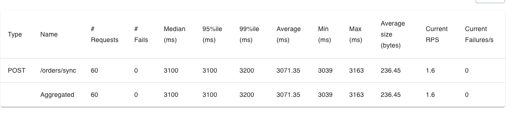
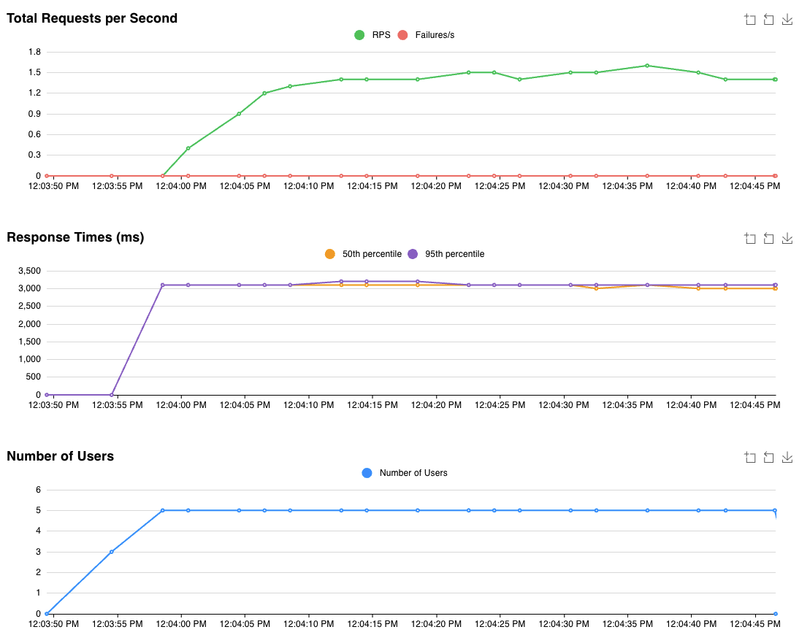
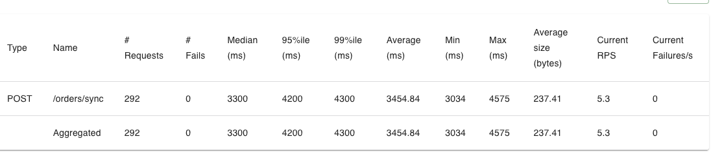
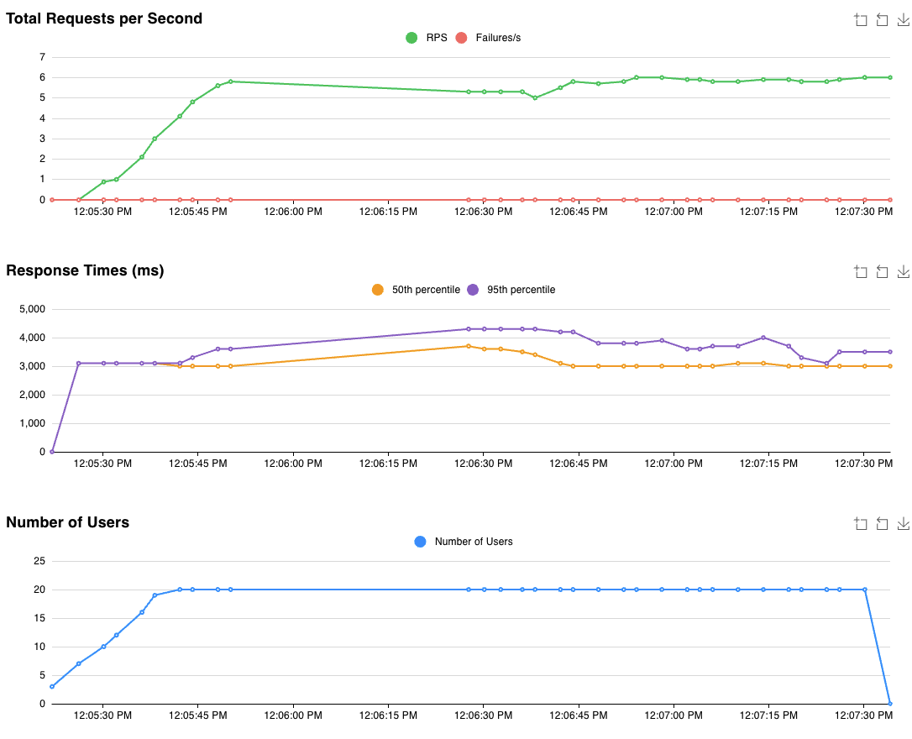

# PART II: The (Simulated!) Problem
Your e-commerce platform runs smoothly with synchronous order processing, handling 5 orders per second during normal operations. Each order requires payment verification that takes 3 seconds (simulate this delay in your system!). Careful here (and thank you Ryan for pointing this out!), when a Go routine sleeps, the thread is actually not blocked. If we want to simulate this bottleneck, we have to get a little more creative to limit throughput, like this buffered channel.

Then marketing launches a surprise flash sale. Expected load: 60 orders per second for one hour.

Your payment processor can't go faster. So what breaks first - your system or your reputation?
# Phase 1: Build Your Current System

Implement synchronous order processing:

```bash
POST /orders/sync → Verify Payment (3s delay) → Return 200 OK
```
#### Test Configuration (use Locust):

Spawn rate: 1 user/second (normal), 10 users/second (flash)
User wait time: random 100-500ms between requests
-  Test endpoint: POST /orders/sync
1. Test Normal Operations: 5 concurrent users, 30 seconds
Expected: 100% success rate


2. Test Flash Sale: 20 concurrent users, 60 seconds


# Phase 2: Analyze the Bottleneck
Do the math:

- Payment processor speed: 1 order per 3 seconds = 1/3 orders per second per processor
- With 20 concurrent customers: Maximum throughput = 20 × (1/3) = 20/3 ≈ 6.67 orders/second
- Flash sale demand: 20 orders/second
- System capacity: 6.67 orders/second
- Orders lost: 20 - 6.67 = 13.33 orders/second

- To handle the full 20 orders/second demand, you'd need at least 60 concurrent processors (20 orders/sec ÷ 1/3 orders/sec/processor = 60 processors).


1. Each user doesn't fire continuously - they wait 100-500ms after getting a response. So actual load is:

Request time: 3 seconds (processing)
Wait time: 0.3 seconds (average)
Total cycle: 3.3 seconds per user

Actual request rate:

5 users: 5/3.3 ≈ 1.5 req/s ✅ (well under 6.67 capacity)
20 users: 20/3.3 ≈ 6.06 req/s ✅ (just under 6.67 capacity!)

2. Locust's Behavior
Locust users don't start a new request until:

Previous request completes (or times out)
Wait time elapses

So if processing takes 3 seconds, users are naturally throttled!

# Phase 3: The Async Solution
```bash
Sync:   Customer → API → Payment (3s) → Response
Async:  Customer → API → Queue → Response (<100ms)
                           ↓
                   Background Workers → Payment (3s)
```

Implement with AWS services:

- SNS Topic: order-processing-events
- SQS Queue: order-processing-queue
- Visibility timeout: 30 seconds (default)
- Message retention: 4 days (default)
- Receive wait time: 20 seconds (long polling)
- Order Receiver: ECS service (1 task, handles both /sync and /async)
- Order Processor: ECS service (1 task, starts with 1 worker goroutine)

New Endpoint:
```bash
POST /orders/async → Publish to SNS → Return 202 Accepted
```

Order Processor Pattern: Your processor continuously polls SQS:

ReceiveMessage (waits up to 20s for messages, returns up to 10)
For each message, spawn goroutine for processing
Repeat forever
Test the same flash sale load. Celebrate the 100% acceptance rate!

# Phase 4: The Queue Problem

Check CloudWatch → SQS Metrics → ApproximateNumberOfMessagesVisible during your test.

That number climbing rapidly? That's your new problem.

Analysis:

Order acceptance rate: ~60/second
Single worker processing rate: 1 order per 3 seconds = 0.33/second
Queue growth rate: _ messages/second
Time to clear backlog: _ minutes
Customer service is getting calls: "Where's my order confirmation?"

# Phase 5: Scale Your Workers

Configuration: Your Order Processor task has:

CPU: 256 units, Memory: 512MB (same task, just adjusting goroutines)
Start with 1 worker goroutine (from Phase 3)
Now scale the concurrent goroutines within this single task:

5 goroutines: Processing rate = _ orders/second
20 goroutines: Processing rate = _
100 goroutines: Processing rate = _
For each test, document:

Peak queue depth during flash sale
Time until queue returns to zero
Resource utilization
Find the balance: What's the minimum workers needed to prevent queue buildup at 60 orders/second?

## CloudWatch Monitoring

Navigate to CloudWatch → Metrics → SQS and monitor ApproximateNumberOfMessagesVisible during tests. Capture screenshots showing:

Queue depth spike during flash sale
Gradual drain as workers process backlog

## Analysis Questions

How many times more orders did your asynchronous approach accept compared to your synchronous approach?
What causes queue buildup and how do you prevent it?
When would you choose sync vs async in production?

# Part III: What If You Didn't Need Queues?